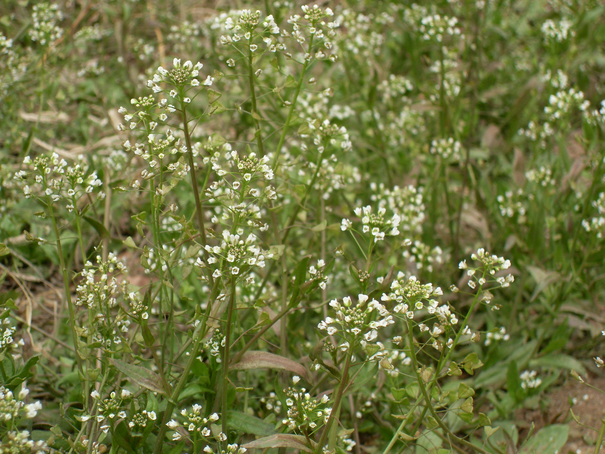

## 荠菜

---

**拉丁名:**  _Capsella bursa-pastoris(L.)_

**科 属:** 十字花科 荠属

**别 名:** 荠

**原产地:** 不详

**形  态:** 一年或两年生草本，高20～30厘米，全株被叉状分枝毛和星状毛。基生叶莲座状，茎生叶互生，披针形，边缘齿状分裂或不裂，基部箭形，抱茎。花白色，4裂。短角果，三角状心形。种子细小，长椭圆形，红绿色。花期3～5月，果期5～6月。

**西大分布地:** 早春常见杂草，三校区均常见。

**备注:** 2009年3月8日摄于西北大学北校区小足球场内。

 

