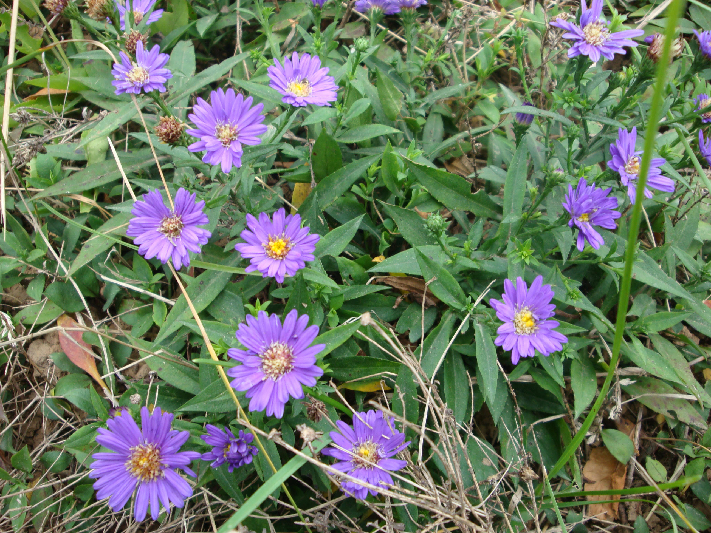

## 荷兰菊

---

**拉丁名:**  _Aster novi-belgii Linn _

**科 属:** 菊科 紫菀族 紫菀属

**别 名:** 柳叶菊
 【原产地】北美
 【形  态】多年生草本，高60～80厘米。茎直立，上部多分枝，
  光滑略有被毛。基生叶长圆形至线状披针形，全缘或有锯齿；
  上部叶无柄，略抱茎。头状花序排列成伞房状生于枝顶，直径
  约2.5厘米；舌状花蓝紫色，长约1.3厘米。瘦果长圆形；冠毛
  毛状，淡黄褐色。花期6～9月，果期9～10月。
 【西大分布地】仅见于南校区西大待开发区。
备注：
    2009年6月17日摄于西北大学南校区西大待开发区。

**原产地:** 北美
 【形 态】多年生草本，高60～80厘米。茎直立，上部多分枝，
 光滑略有被毛。基生叶长圆形至线状披针形，全缘或有锯齿；
 上部叶无柄，略抱茎。头状花序排列成伞房状生于枝顶，直径
 约2.5厘米；舌状花蓝紫色，长约1.3厘米。瘦果长圆形；冠毛
 毛状，淡黄褐色。花期6～9月，果期9～10月。
【西大分布地】仅见于南校区西大待开发区。
备注：
 2009年6月17日摄于西北大学南校区西大待开发区。

**形  态:** 多年生草本，高60～80厘米。茎直立，上部多分枝，光滑略有被毛。基生叶长圆形至线状披针形，全缘或有锯齿；上部叶无柄，略抱茎。头状花序排列成伞房状生于枝顶，直径约2.5厘米；舌状花蓝紫色，长约1.3厘米。瘦果长圆形；冠毛毛状，淡黄褐色。花期6～9月，果期9～10月。

**西大分布地:** 仅见于南校区西大待开发区。

**备注:** 2009年6月17日摄于西北大学南校区西大待开发区。

.JPG) 

 

