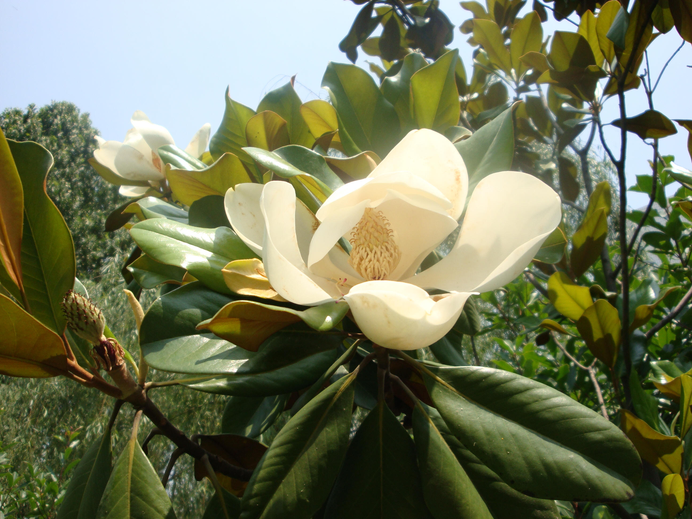
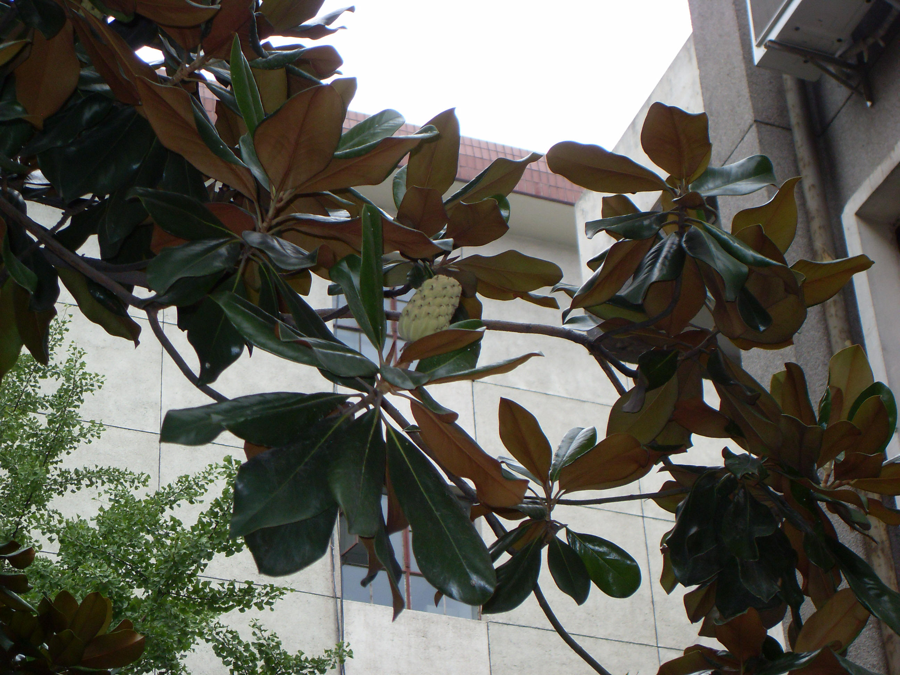

## 荷花玉兰

---

**拉丁名:**  _Magnolia grandiflora Linn_

**科 属:** 木兰科 木兰属

**别 名:** 洋玉兰、广玉兰

**原产地:** 北美东部

**形  态:** 常绿乔木，高达30米。树冠阔圆锥形。芽及小叶有锈色柔毛。叶倒卵状长椭圆形，长12～20厘米，革质，叶端钝，基部楔形，叶表有光泽，叶被有铁锈色短柔毛，叶缘稍稍微波状；叶柄粗，长2厘米。花杯形，白色，极大，径约20～25厘米，有芳香，花通常6瓣；萼片花瓣状，3枚；花丝紫色。聚合果圆柱状卵形，密被锈毛。种子红色。花期5～8月，果期10月。　　　　

**西大分布地:** 北校区见于六号教学楼后、文博学院楼后及地质系楼后草坪等处；

**备注:** 上图为荷花玉兰花枝，2009年5月25日摄于西北大学北校区地质系楼后草；左图为荷花玉兰果实，2009年8月21日摄于西北大学北校区六号教学楼后。

 

 

 

