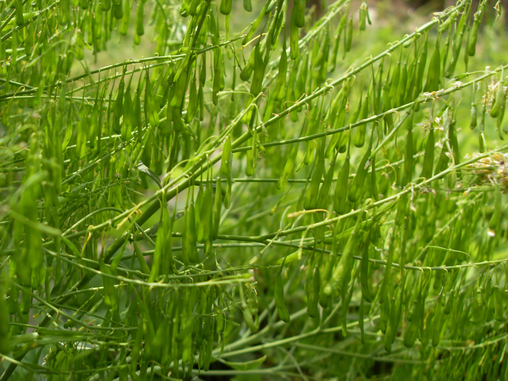
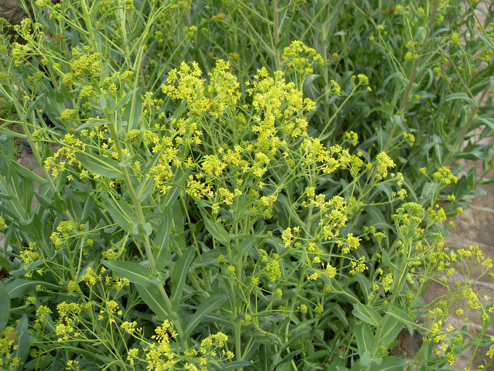

## 菘蓝

---

**拉丁名:**  _Isatis indigotica Fortune _

**科 属:** 十字花科 菘蓝属

**别 名:** 板蓝根、大青叶

**原产地:** 中国

**形  态:** 两年生草本，高40～100厘米。茎直立，绿色，上部分枝植株光滑无毛，带白粉霜。基部叶莲座状，长圆形至宽倒披针形，长5～15厘米，宽2～4厘米，肥厚，先端钝或尖，基部渐狭，全缘或略有波状齿，具柄；茎生叶蓝绿色，长椭圆形或长圆状披针形。花瓣黄色宽楔形，先端平截，基部具爪，长约4毫米。短角果近长圆形，扁平翅状；果柄细弱下弯或弧形。种子长圆形，长约3毫米，淡褐色。花期4～5月，果期6月。　　　　　

**西大分布地:** 仅见于北校区西大花园内。

**备注:** 上图为菘蓝花枝，2009年3月30日摄于西北大学北校区西大花园内。下图为菘蓝果枝，2009年4月17日摄于西北大学北校区西大花园内。

 

 

