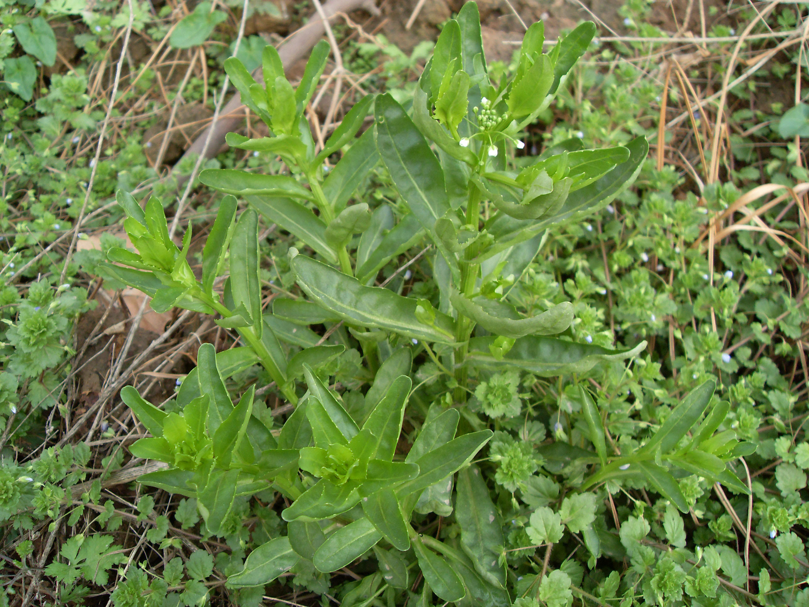

## 菥蓂

---

**拉丁名:**  _Thlaspi arvense Linn_

**科 属:** 十字花科 菥蓂属

**别 名:** 犁头菜、遏蓝菜
【形  态】一年生草本，高10～60厘米。茎直立，分枝或不分枝
 ，无毛。基部叶长圆形，有长柄，先端钝圆，全缘；茎生叶披针
 形或长圆状披针形，长2～5厘米，宽5～20毫米，先端钝或锐，基
 部箭形，抱茎。花白色，4瓣，花瓣先端圆或微凹。短角果扁平。
 圆形或近椭圆形，周边有阔翅，顶端有缺口，熟时开裂。种子倒
 卵形略扁平，两面各有10～14个环点状环纹。花期3～4月，果期
 5～6月。
【西大分布地】早春常见杂草，见于桃园校区和南校区荒草丛中。
备注：
    2009年3月28日摄于西北大学桃园校区文化山北侧垃圾草丛。
　

**原产地:** 菥 蓂
详细资料： 首页 下一页 上一页
【拉丁名】Thlaspi arvense Linn.
【科 属】十字花科 菥蓂属
【别 名】犁头菜、遏蓝菜

**形  态:** 一年生草本，高10～60厘米。茎直立，分枝或不分枝，无毛。基部叶长圆形，有长柄，先端钝圆，全缘；茎生叶披针形或长圆状披针形，长2～5厘米，宽5～20毫米，先端钝或锐，基部箭形，抱茎。花白色，4瓣，花瓣先端圆或微凹。短角果扁平。圆形或近椭圆形，周边有阔翅，顶端有缺口，熟时开裂。种子倒卵形略扁平，两面各有10～14个环点状环纹。花期3～4月，果期5～6月。

**西大分布地:** 早春常见杂草，见于桃园校区和南校区荒草丛中。

**备注:** 2009年3月28日摄于西北大学桃园校区文化山北侧垃圾草丛。　

 

