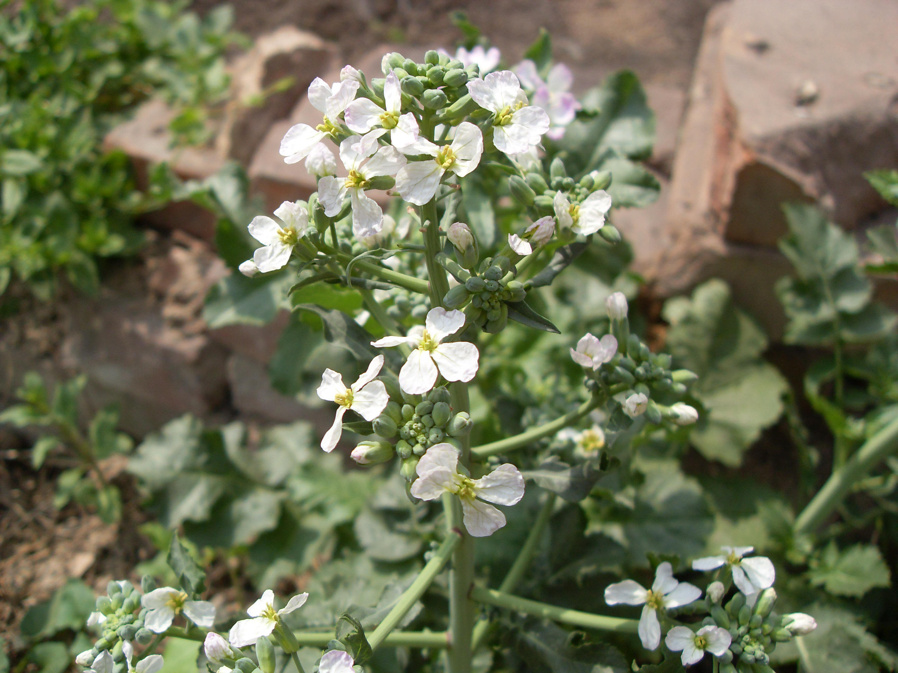

## 萝卜

---

**拉丁名:**  _Raphanus sativus Linn_

**科 属:** 十字花科 萝卜属

**别 名:** 菜菔（fú）

**原产地:** 中国

**形  态:** 一、二年生草本。根肉质，长圆形、球形或圆锥形，根皮红色、绿色、白色、粉红色或紫色。茎直立，粗壮，圆柱形，中空，自基部分枝。基生叶及茎下部叶有长柄，通常大头羽状分裂，被粗毛，侧裂片1～3对，边缘有锯齿或缺刻；茎中、上部叶长圆形至披针形，向上渐变小，不裂或稍分裂，不抱茎。总状花序，顶生及腋生。花淡粉红色或白色。长角果，不开裂，近圆锥形，直或稍弯，种子间缢缩成串珠状，先端具长喙。花期4～5月，果期5～6月。

**西大分布地:** 见于北校区西大花园内。

**备注:** 2009年4月17日摄于西北大学北校区西大花园内。

.JPG) 

 

