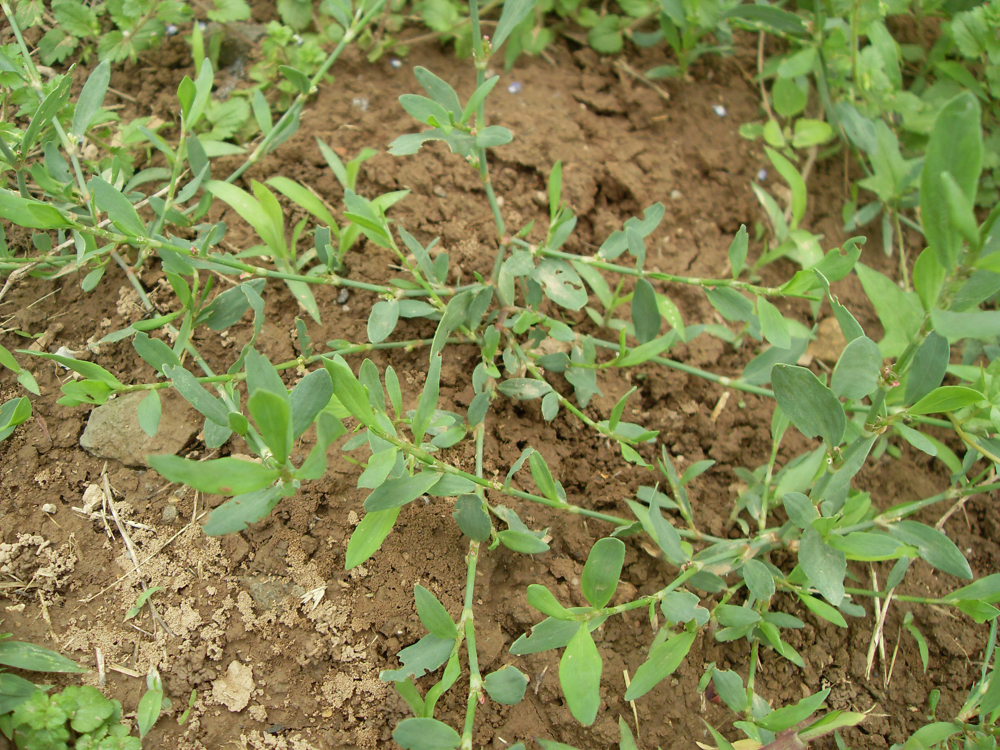

## 萹蓄

---

**拉丁名:**  _Polygonum aviculare Linn_

**科 属:** 蓼科 蓼属

**别 名:** 扁竹、竹节草
【形  态】一年生草本。枝平卧或斜生，稀近直立，基部多分枝，
 长达40厘米，有沟纹，基部圆柱形。叶椭圆形或披针形，长1～
 4厘米，宽0.3～1.2厘米，先端钝或锐尖，基部楔形，全缘，蓝
 绿色；叶柄短或无，基部具关节；托叶鞘膜质。花单生或簇生叶
 脉，遍布植株，每簇有6～10朵。瘦果卵状三棱形，长约3毫米，
 黑褐色。花果期5～9月。
【西大分布地】常见夏秋杂草，见于三校区各处。
备注：
    2009年5月17日摄于西北大学南校区待开发区草丛。

**原产地:** 萹 蓄

【拉丁名】Polygonum aviculare Linn.
【科 属】蓼科 蓼属
【别 名】扁竹、竹节草

**形  态:** 一年生草本。枝平卧或斜生，稀近直立，基部多分枝，长达40厘米，有沟纹，基部圆柱形。叶椭圆形或披针形，长1～4厘米，宽0.3～1.2厘米，先端钝或锐尖，基部楔形，全缘，蓝绿色；叶柄短或无，基部具关节；托叶鞘膜质。花单生或簇生叶脉，遍布植株，每簇有6～10朵。瘦果卵状三棱形，长约3毫米，黑褐色。花果期5～9月。

**西大分布地:** 常见夏秋杂草，见于三校区各处。

**备注:** 2009年5月17日摄于西北大学南校区待开发区草丛。

.JPG) 

 

