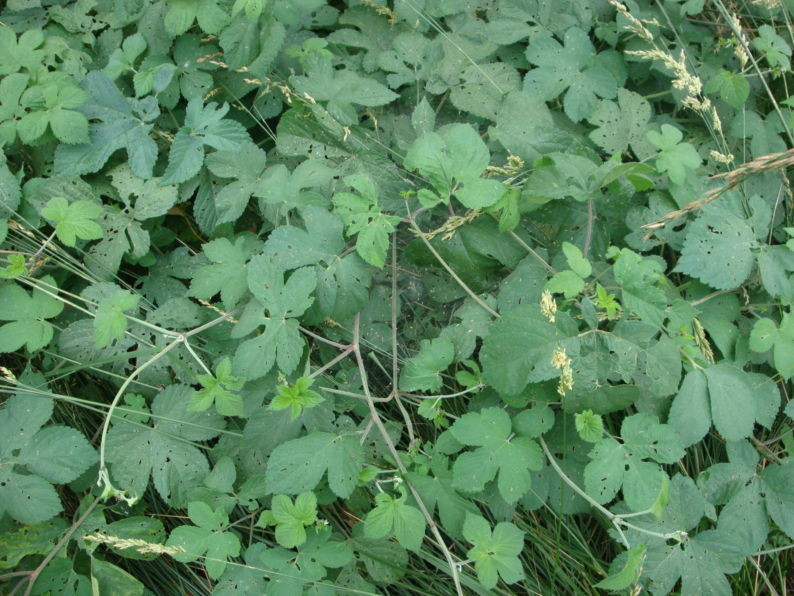

## 葎草

---

**拉丁名:**  _Humulus scandens (Lour.) Merr_

**科 属:** 桑科 葎草属

**别 名:** 葛麻藤、降龙草

**原产地:** 中国、日本

**形  态:** 一年生缠绕藤本。茎粗糙，绿色或稍带红色，多角形，茎、枝、叶柄均有倒钩刺及密细毛。叶对生，肾状五角形，掌状5～7裂，长5～7厘米，基部心形，表面粗糙，疏生糙伏毛，背面有柔毛及黄色腺点；裂片卵状三角形，边缘有锯齿；叶柄长达10厘米。雄花序圆锥状，长15～25厘米；雌花序球果状，直径约5毫米。瘦果扁球形，褐红色。花期7～8月，果期9～10月。

**西大分布地:** 常见杂草，见于三校区各处。

**备注:** 2009年6月17日摄于西北大学南校区待开发区。

.JPG) 

 

