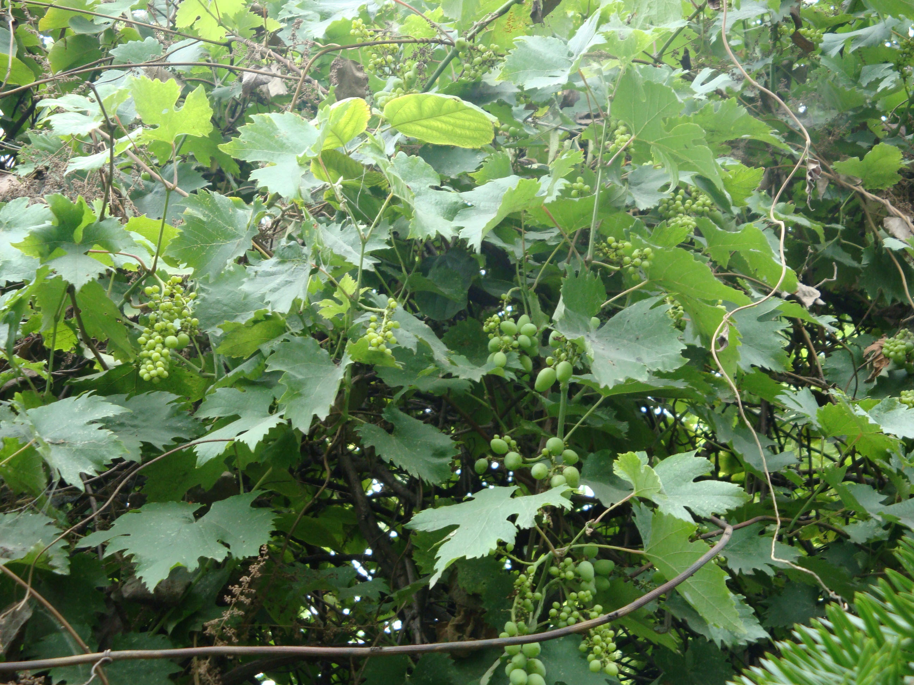

## 葡萄

---

**拉丁名:**  _Vitis vinifera Linn _

**科 属:** 葡萄科 葡萄属

**别 名:** 蒲桃、草龙珠、山葫芦
 【原产地】亚洲西部
 【形  态】落叶大藤本，长达20米。枝粗壮，幼枝常具羊毛状毛
  或光滑。叶近圆形，显著3～5浅裂或中裂，边缘有粗锯齿，叶基
  部深心形，基部两侧靠和或重叠，表面深绿色，无毛，背面光滑
  或有柔毛。圆锥花序大而长。果实椭圆形或近球形，成熟时紫红
  色或带绿色。花期6月，果期8～9月。
  【西大分布地】见于北校区西大花园内。
备注：
    2009年6月15日摄于西北大学北校区西大花园内。

**原产地:** 亚洲西部
【形 态】落叶大藤本，长达20米。枝粗壮，幼枝常具羊毛状毛
 或光滑。叶近圆形，显著3～5浅裂或中裂，边缘有粗锯齿，叶基
 部深心形，基部两侧靠和或重叠，表面深绿色，无毛，背面光滑
 或有柔毛。圆锥花序大而长。果实椭圆形或近球形，成熟时紫红
 色或带绿色。花期6月，果期8～9月。
 【西大分布地】见于北校区西大花园内。
备注：
 2009年6月15日摄于西北大学北校区西大花园内。

**形  态:** 落叶大藤本，长达20米。枝粗壮，幼枝常具羊毛状毛或光滑。叶近圆形，显著3～5浅裂或中裂，边缘有粗锯齿，叶基部深心形，基部两侧靠和或重叠，表面深绿色，无毛，背面光滑或有柔毛。圆锥花序大而长。果实椭圆形或近球形，成熟时紫红色或带绿色。花期6月，果期8～9月。

**西大分布地:** 见于北校区西大花园内。

**备注:** 2009年6月15日摄于西北大学北校区西大花园内。

 

