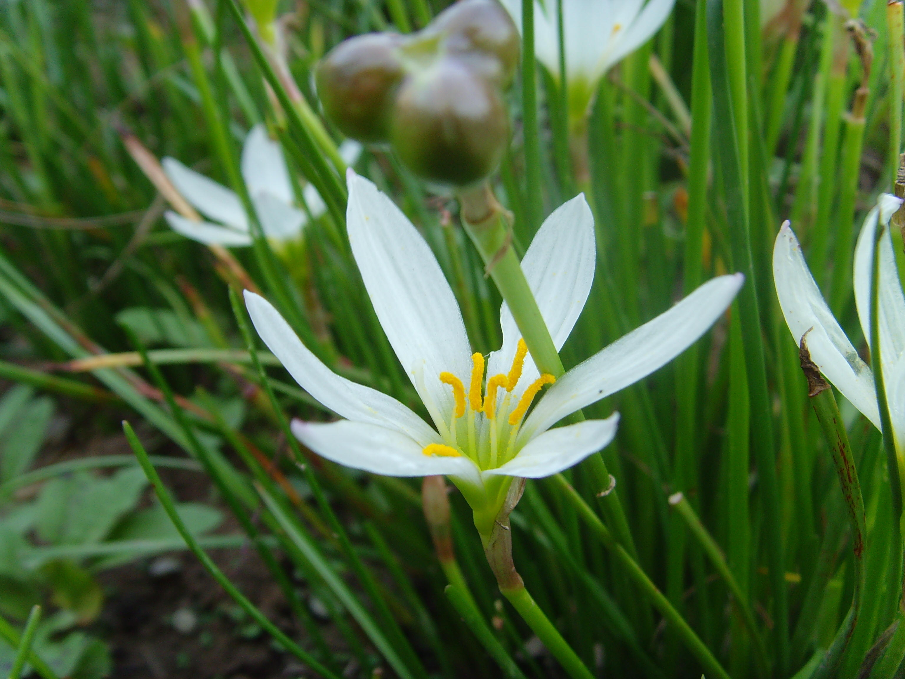

## 葱

---

**拉丁名:**  _Allium fistulosum Linn_

**科 属:** 百合科 葱属

**别 名:** 大葱

**原产地:** 中国

**形  态:** 一年生草本，常簇生。叶圆筒状，有白粉，中空。花葶中空，肥状；伞形花序，球形，总苞片膜质，白色，2裂卵形；花白色，花被片4，长约6毫米。蒴果，种子黑色。花期5～7月，果期7～9月。

**西大分布地:** 仅见于北校区西大花园内

**备注:** 2009年4月17日摄于西北大学北校区西大花园内。

.JPG) 

 

 

