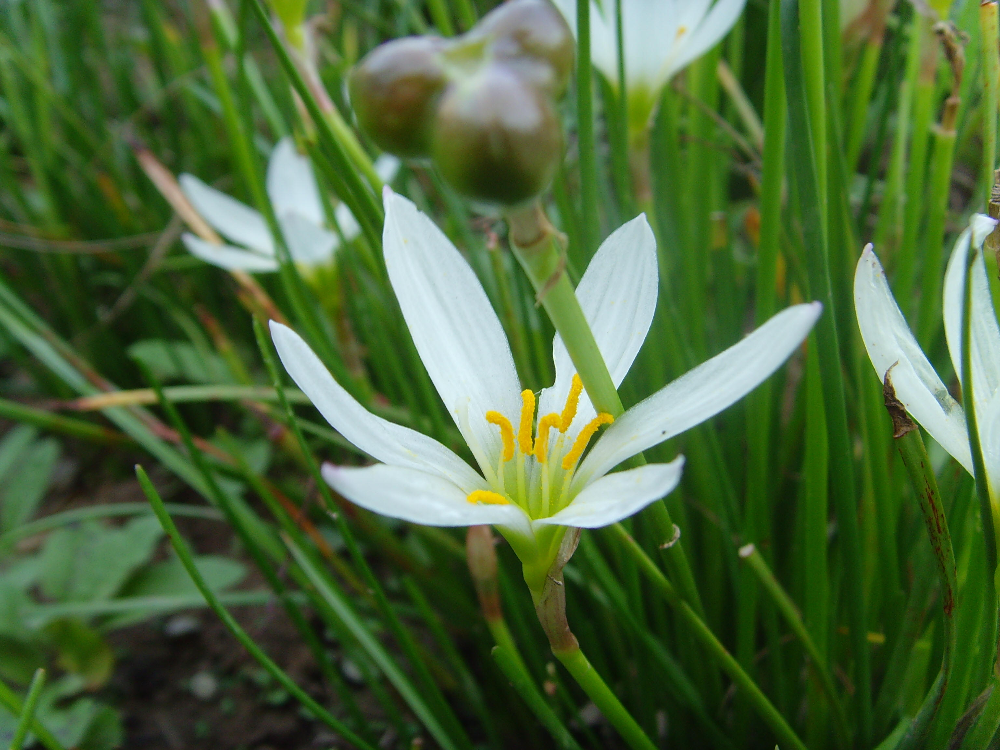

## 葱兰

---

**拉丁名:**  _Zephyranthes candida Herb_

**科 属:** 石蒜科 葱兰属

**别 名:** 葱莲，玉帘，白花菖蒲莲

**原产地:** 南美

**形  态:** 多年生常绿草本，具小而颈部细长的鳞茎株高15～20厘米。叶基生，线形，稍肉质，暗绿色。花葶中空，高10～20厘米，包于具有褐红色膜质包片内，自叶丛一侧抽出。花单生，白色，花被片6，椭圆状披针形，无筒部，花径3～4厘米，花期7～11月。蒴果三角球形，成熟室背开裂。

**西大分布地:** 西北大学北校区生命科学学院北楼后花坛。

**备注:** 2008年9月5日摄于西北大学北校区生命科学学院北楼后花坛。

 

