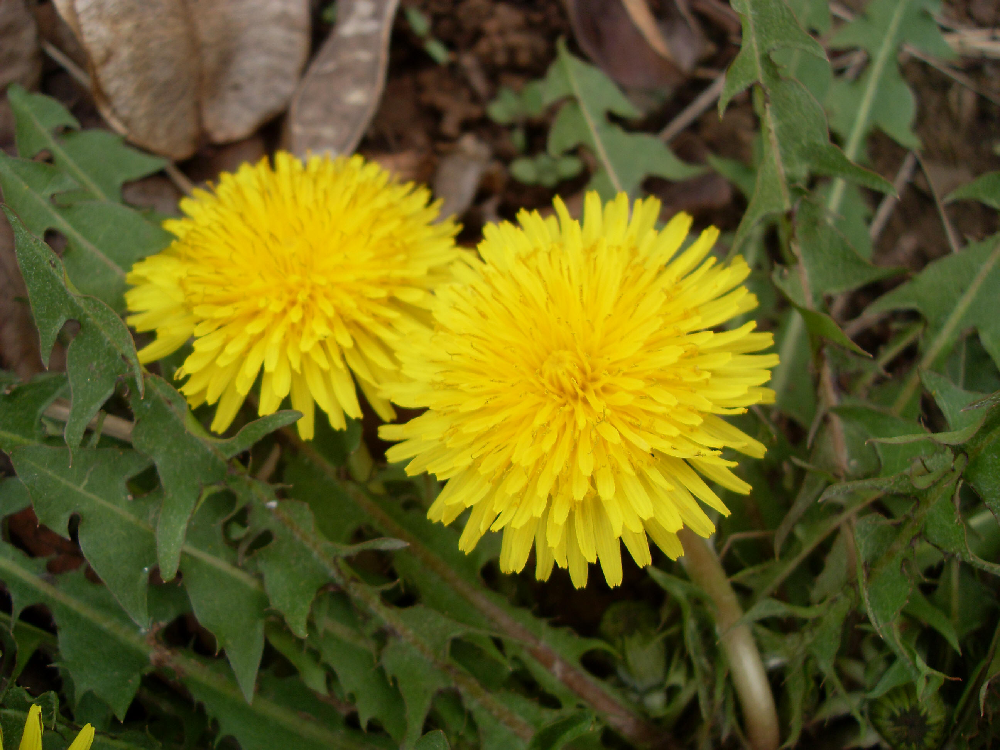
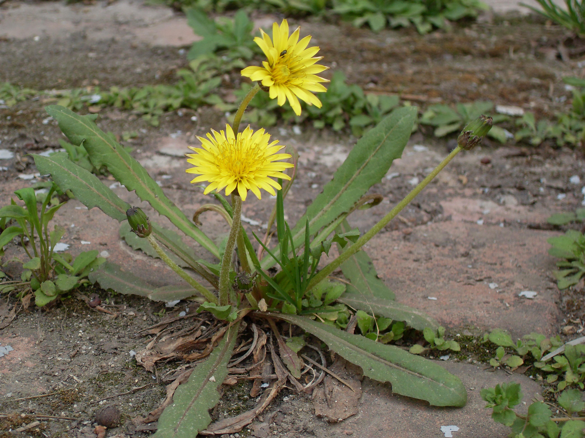
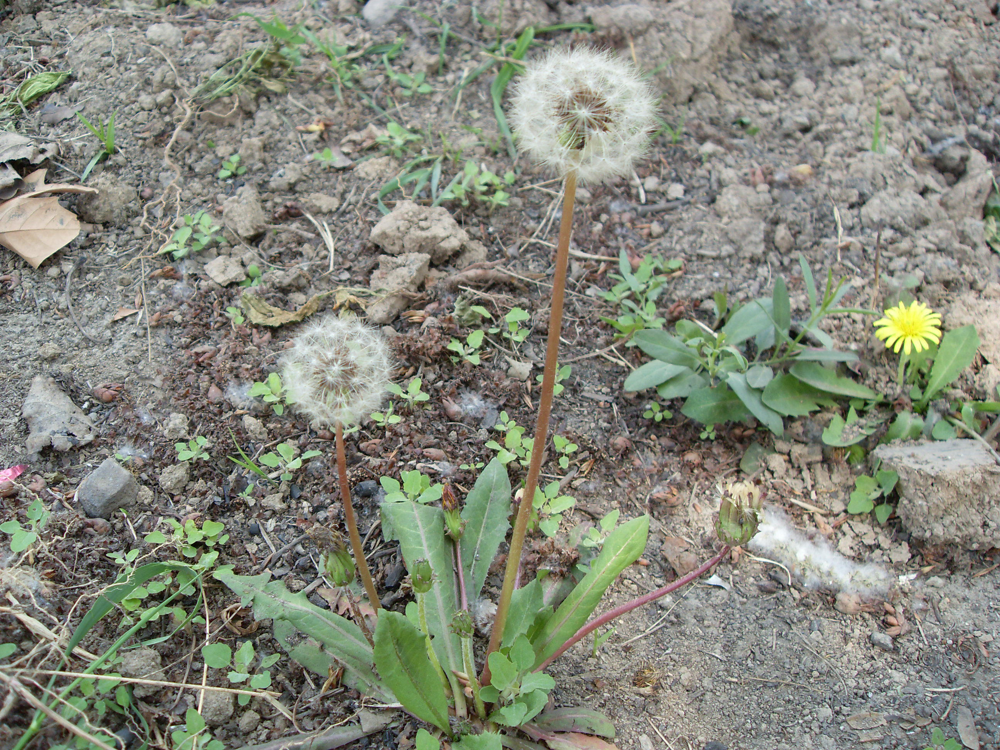

## 蒲公英

---

**拉丁名:**  _Taraxacum mongolicum Hand.-Mazz_

**科 属:** 菊科 蒲公英属

**别 名:** 蒲公草、奶汁草
【形  态】多年生草本，高10～25cm，含白色乳汁。根深
 长，单一或分枝，外皮黄棕色。叶根生，排成莲座状，狭
 倒披针形，大头羽裂或羽裂，裂片三角形，全缘或有数齿
 ，先端稍钝或尖，基部渐狭成柄，无毛蔌有蛛丝状细软毛。
 花茎比叶短或等长，结果时伸长，上部密被白色珠丝状毛。
 头状花序单一，顶生，长约3.5cm；总苞片草质，绿色，部
 分淡红色或紫红色，先端有或无小角，有白色珠丝状毛；
 舌状花鲜黄色，先端平截，5齿裂，两性。瘦果倒披针形
 ，先端有喙，顶生白色冠毛。花期早春及晚秋。
　
                                                                 【西大分布地】常见杂草，见于三校区各处。
                                                                  备注：
                                                                      上图摄于2009年3月19日西北大学北校区图书馆楼后；
                                                                      下图摄于2009年4月7日西北大学北校区操场旁。
　
　
                                                               

**原产地:** 蒲公英
详细资料： 首页 下一页上一页
【拉丁名】Taraxacum mongolicum Hand.-Mazz.
【科 属】菊科 蒲公英属
【别 名】蒲公草、奶汁草

**形  态:** 多年生草本，高10～25cm，含白色乳汁。根深长，单一或分枝，外皮黄棕色。叶根生，排成莲座状，狭倒披针形，大头羽裂或羽裂，裂片三角形，全缘或有数齿，先端稍钝或尖，基部渐狭成柄，无毛蔌有蛛丝状细软毛。花茎比叶短或等长，结果时伸长，上部密被白色珠丝状毛。头状花序单一，顶生，长约3.5cm；总苞片草质，绿色，部分淡红色或紫红色，先端有或无小角，有白色珠丝状毛；舌状花鲜黄色，先端平截，5齿裂，两性。瘦果倒披针形，先端有喙，顶生白色冠毛。花期早春及晚秋。　

**西大分布地:** 常见杂草，见于三校区各处。 

**备注:** 上图摄于2009年3月19日西北大学北校区图书馆楼后；下图摄于2009年4月7日西北大学北校区操场旁。　　

 

 

 

