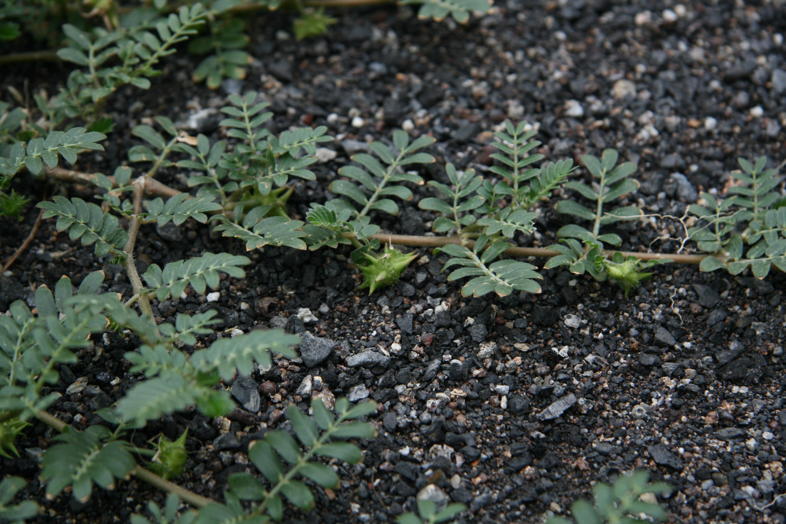
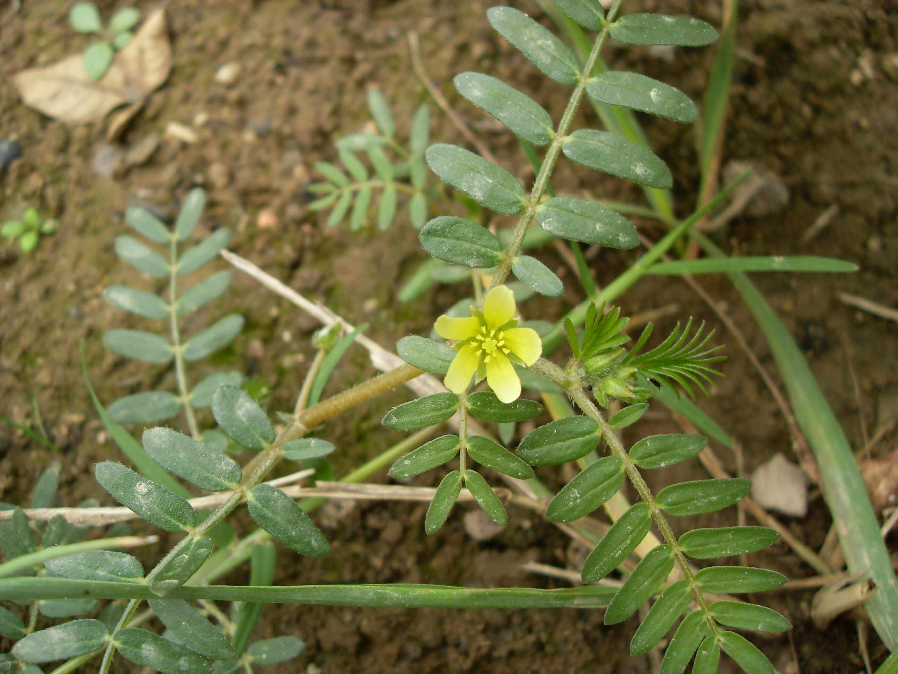

## 蒺藜

---

**拉丁名:**  _Tribulus terrester Linn_

**科 属:** 蒺藜科 蒺藜属

**别 名:** 硬蒺藜、蒺骨子、刺蒺藜
【形  态】一年生草本，全株备有短柔毛。茎分枝多，平卧或
 上端斜升，具纵条纹或浅槽。偶数羽状复叶，小叶8～14，长
 圆形；两端小叶较中部稍小。托叶成对，披针形。花有长花柄
 ，花径约8～18毫米，花瓣倒卵状长圆形，黄色。果实为分果，
 常由5个不分裂的果瓣组成，成熟后分离，果瓣上有刺。种子
 卵状三角形。花期7～8月，果期9～10月。
　
　
　
　
                                                                    【西大分布地】三校区常见杂草，见于各处。
                                                                     备注：
                                                                        上图为蒺藜果枝，李智选老师2008年8月15日摄于西北大学北校区；
                                                                        左图为蒺藜花枝，2009年5月30日摄于西北大学北校区。

**原产地:** 蒺 藜
详细资料： 首页 下一页上一页 
【拉丁名】Tribulus terrester Linn.
【科 属】蒺藜科 蒺藜属
【别 名】硬蒺藜、蒺骨子、刺蒺藜

**形  态:** 一年生草本，全株备有短柔毛。茎分枝多，平卧或上端斜升，具纵条纹或浅槽。偶数羽状复叶，小叶8～14，长圆形；两端小叶较中部稍小。托叶成对，披针形。花有长花柄，花径约8～18毫米，花瓣倒卵状长圆形，黄色。果实为分果，常由5个不分裂的果瓣组成，成熟后分离，果瓣上有刺。种子卵状三角形。花期7～8月，果期9～10月。　　　　

**西大分布地:** 三校区常见杂草，见于各处。 

**备注:** 上图为蒺藜果枝，李智选老师2008年8月15日摄于西北大学北校区；左图为蒺藜花枝，2009年5月30日摄于西北大学北校区。

 

 

