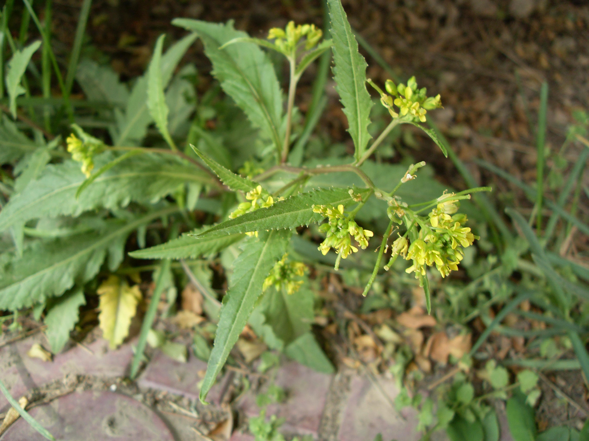

## 蔊菜

---

**拉丁名:**  _Rorippa indica (Linn.) Hiern _

**科 属:** 十字花科 蔊菜属

**别 名:** 野油菜、辣米菜

**原产地:** 中国

**形  态:** 一、二年生草本，高20～40厘米，全株无毛，茎单一或分枝，表面具纵沟。基生叶及茎下部叶叶形多变化，通常大头羽状分裂，侧裂片1～5对，先端钝圆，基部有长柄，边缘有波状不整齐的牙齿；茎生上部叶多不分裂，宽披针形或匙形，基部有短柄或耳状裂抱茎，边缘具疏齿。总状花序，花小，多数，具细梗；花瓣黄色，匙形，4瓣。长角果线形，种子细小，褐黄色。花果期4～8月。

**西大分布地:** 常见杂草，见于三校区各处。

**备注:** 2009年4月17日摄于北校区七号教学楼后。　

.JPG) 

 

