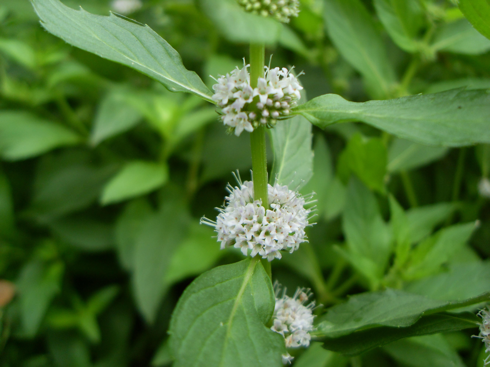

## 薄荷

---

**拉丁名:**  _Mentha haplocalyx Briq _

**科 属:** 唇形科 薄荷属

**别 名:** 夜息香、蕃荷菜
 【形  态】多年生草本，茎高30～60厘米。叶矩圆状披针形
  至披针状椭圆形，长3～7厘米，对生。花萼筒状钟形，10
  脉，5齿，狭三角状钻形；花冠淡紫外被毛内面在喉部下被
  微柔毛。小坚果卵球形。花期6～7月，果期8～9月。
 【西大分布地】仅见于北校区西大花园内。
备注：
    2009年7月28日摄于西北大学北校区西大花园内。
    

**原产地:** 薄 荷
详细资料：  首页 下一页 上一页
【拉丁名】Mentha haplocalyx Briq.
【科 属】唇形科 薄荷属
【别 名】夜息香、蕃荷菜
【形 态】多年生草本，茎高30～60厘米。叶矩圆状披针形
 至披针状椭圆形，长3～7厘米，对生。花萼筒状钟形，10
 脉，5齿，狭三角状钻形；花冠淡紫外被毛内面在喉部下被
 微柔毛。小坚果卵球形。花期6～7月，果期8～9月。
【西大分布地】仅见于北校区西大花园内。
备注：
 2009年7月28日摄于西北大学北校区西大花园内。
 

**形  态:** 多年生草本，茎高30～60厘米。叶矩圆状披针形至披针状椭圆形，长3～7厘米，对生。花萼筒状钟形，10脉，5齿，狭三角状钻形；花冠淡紫外被毛内面在喉部下被微柔毛。小坚果卵球形。花期6～7月，果期8～9月。

**西大分布地:** 仅见于北校区西大花园内。

**备注:** 2009年7月28日摄于西北大学北校区西大花园内。

.JPG) 

 

