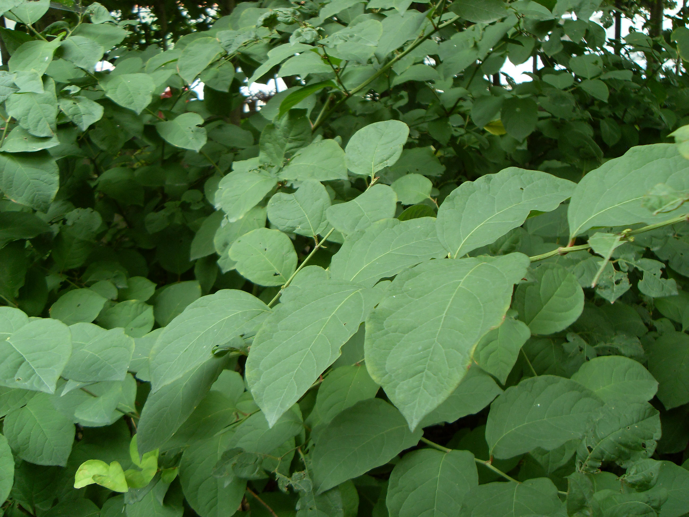

## 虎杖

---

**拉丁名:**  _Reynoutria japonica Houtt_

**科 属:** 蓼科 虎杖属

**别 名:** 花斑竹、酸筒杆

**原产地:** 中国 

**形  态:** 多年生灌木状草本，无毛，高1～1.5米。根状茎横走，木质化，外皮黄褐色。茎直立，丛生，中空，表面散生红色或紫红色斑点。叶片宽卵状椭圆形或卵形，长6～12厘米，宽5～9厘米，顶端急尖，基部圆形或阔楔形；托叶鞘褐色，早落。花单性，雌雄异株，圆锥花序腋生；花梗细长。瘦果椭圆形，有3棱，黑褐色，光亮。花期6～7月，果期9～10月。

**西大分布地:** 仅见于北校区西大花园内。

**备注:** 2009年8月21日摄于西北大学北校区西大花园内。　

.JPG) 

 

