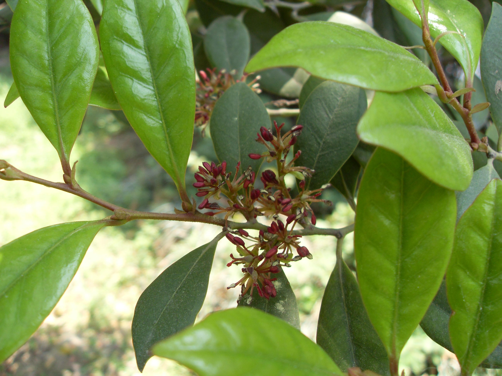

## 蚊母树

---

**拉丁名:**  _Distylium racemosum Sieb.et Zucc_

**科 属:** 金缕梅科 蚊母树属

**别 名:** 蚊子树、米心树

**原产地:** 中国华南

**形  态:** 常绿乔木，高达25米。树冠常球形，小枝略呈“之”字形曲折。叶倒卵长长椭圆形，长3～7厘米，先端钝或稍圆，全缘，后革质，光滑无毛。总状花序长约2厘米，花药红色。蒴果卵形，长约1厘米，密生形状毛，顶端有两宿存花柱。花期4月，果期9月。

**西大分布地:** 分布于北校区六号教学楼北侧花坛及图书馆前花坛内。　　　 

**备注:** 上图为蚊母树果枝摄于2008年9月22日西北大学北校区六号教学楼北侧花坛。下图为蚊母树花枝摄于2009年4月7日西北大学北校区图书馆前花坛内。

 

 

