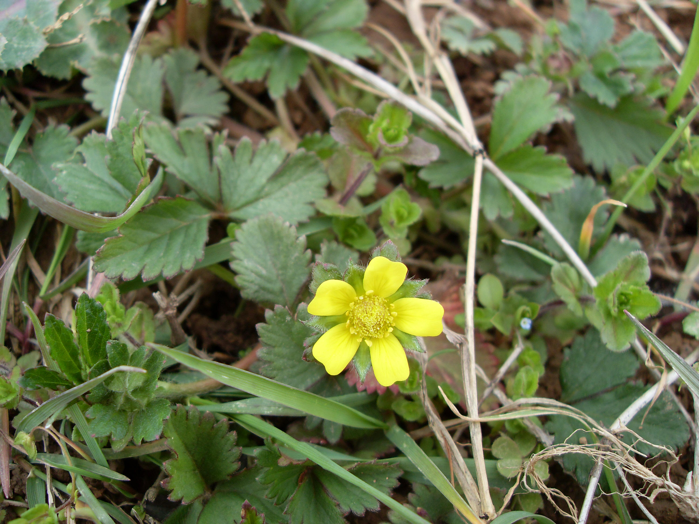
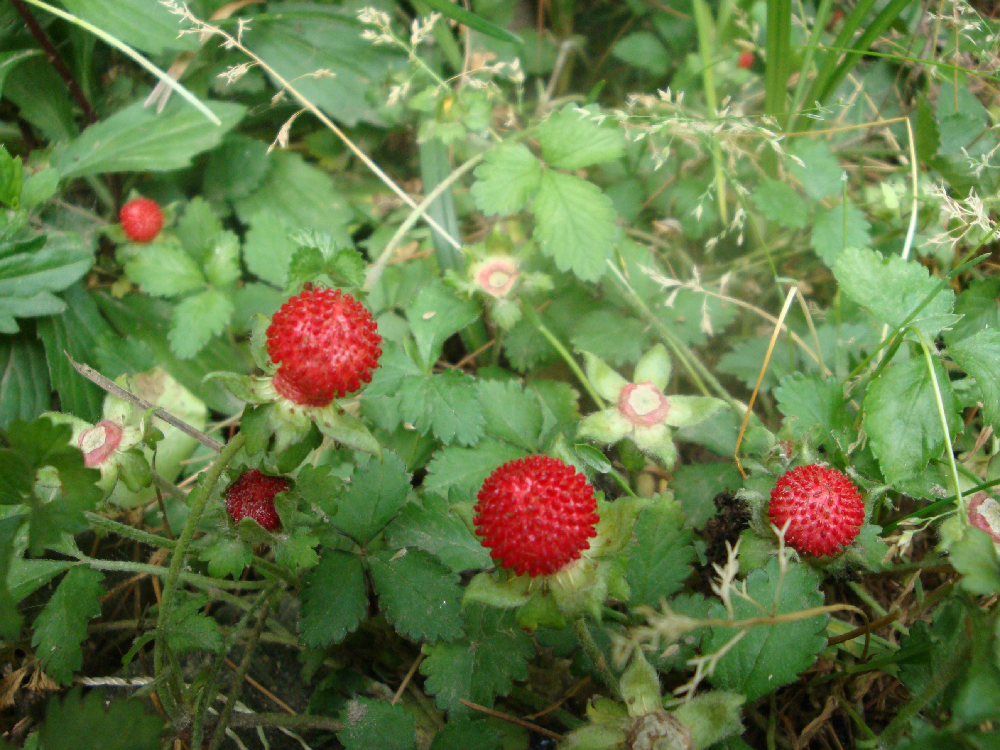

## 蛇莓

---

**拉丁名:**  _Duchesnea indica (Andr.) Focke _

**科 属:** 蔷薇科 蛇莓属

**别 名:** 三叶莓、地杨梅

**原产地:** 中国

**形  态:** 多年生草本，有细长的匍匐茎，节上有不定根，被柔毛。掌状三出复叶，小叶无柄或具短柄，菱状卵形或倒卵形，先端稍钝，基部楔形，长1.5～2厘米，宽1～1，8厘米，边缘具钝锯齿，表面几无毛，背面具柔毛。花单生于叶腋，直径约1厘米，花瓣黄色，长圆形或倒卵圆形；花托膨大呈球形或长椭圆形，柔软，红色，着生多数瘦果，形成聚合果。花期4～5月，果期6～7月。　　

**西大分布地:** 常见林下杂草，见于三校区 

**备注:** 上图为蛇莓花枝，2009年3月29日摄于西北大学南校区待开发区；左图为蛇莓果枝，2009年5月4日摄于西北大学北校区西大花园内。

 

 

