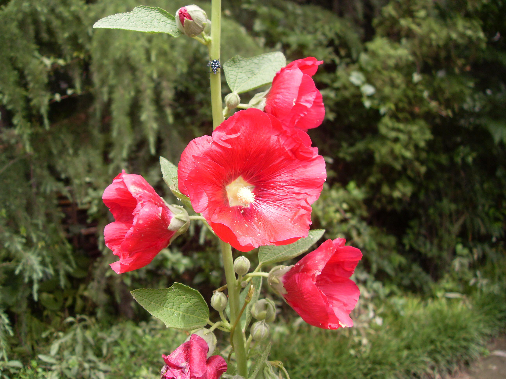

## 蜀葵

---

**拉丁名:**  _Althaea rosea (Linn.) Cavan_

**科 属:** 锦葵科 蜀葵属

**别 名:** 一丈红、端午锦

**原产地:** 中国

**形  态:** 多年生草本，茎直立，少分枝，株高达2.5～3米。叶互生，近圆形，叶基心脏形，叶缘有5～7浅裂，叶柄长。花单生叶腋，有副萼，花萼圆杯状；单瓣花种花5瓣，直径约5厘米，办片倒卵形，先端边缘有不规则齿裂，花色较多。果实扁圆盘形，径约3厘米。种子宽肾形。花期6～8月。果实花后渐次成熟。　　　

**西大分布地:** 北校区见于西大花园内。

**备注:** 上图为蜀葵一单瓣红色花品种，2009年5月30日摄于西北大学北校区西大花园内；左图为蜀葵一单瓣白色花品种，2009年6月15日摄于西北大学北校区西大花园内。

.JPG) 

 

