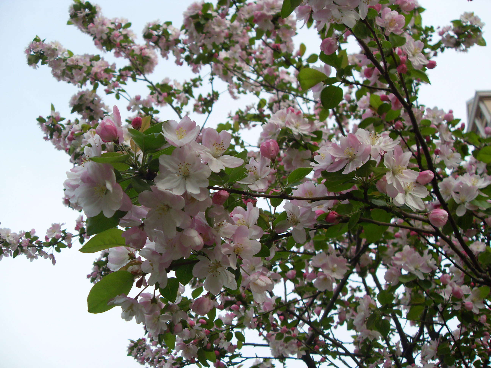
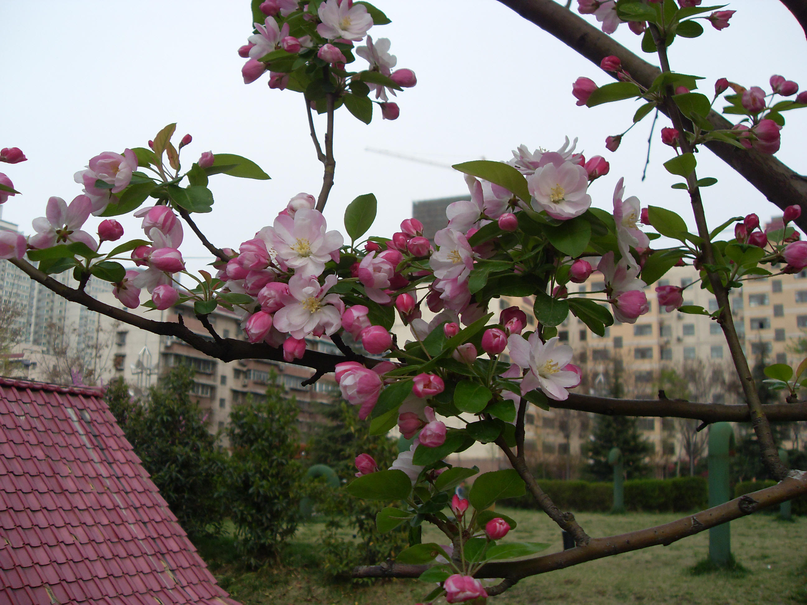

## 西府海棠

---

**拉丁名:**  _Malus mircromalus Mak_

**科 属:** 蔷薇科 苹果属

**别 名:** 海棠花、小果海棠

**原产地:** 中国北部

**形  态:** 落叶小乔木，树态峭立；小枝紫褐色或暗褐色，幼时有短柔毛。叶长椭圆形，长5～10厘米，先端渐尖，基部广楔形，锯齿尖细，背面幼时有毛，叶质硬实，表面有光泽；叶柄细长2～3厘米。花淡红色，径月4厘米，花朵瓣。果实近球形，红色，直径1～1.5厘米，萼片有少数宿存。花期3～4月，果期8～9月。

**西大分布地:** 仅见于桃园校区教工家属区草坪内。

**备注:** 2009年3月28日摄于西北大学桃园校区教工家属区草坪内。

 

 

