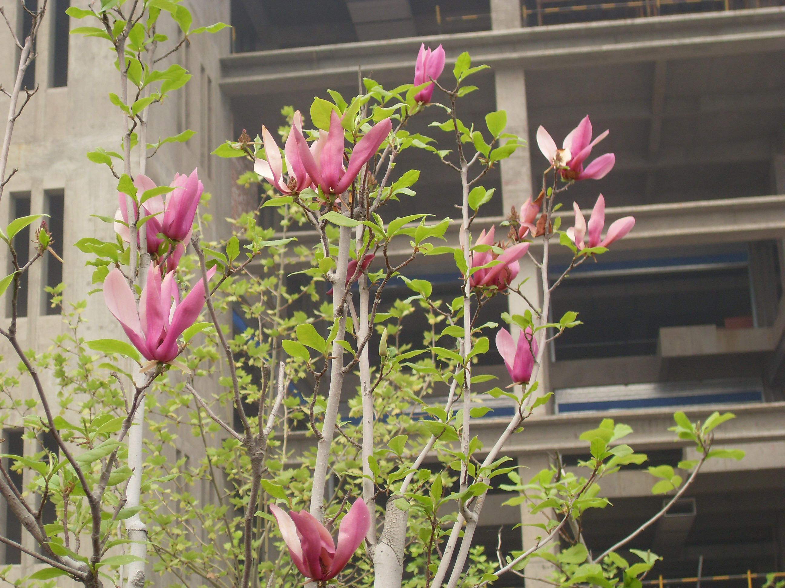

## 辛夷

---

**拉丁名:**  _Magnolia liliflora Desr_

**科 属:** 木兰科 木兰属

**别 名:** 木兰、木笔、紫玉兰

**原产地:** 中国中部

**形  态:** 落叶大灌木，高3～5米。大枝近直伸，小枝紫褐色，无毛。叶椭圆形或倒卵状椭圆形，长10～18厘米，先端渐尖，基部楔形。花大，花瓣6，外面紫色，内面近白色；萼片3，黄绿色，披针形，长为花瓣的1/3，早落。聚合果长圆柱形，长7～10厘米淡褐色。花期4～5月。

**西大分布地:** 仅见于南校区音乐广场西边小丘上。

**备注:** 2009年4月12日摄于西北大学南校区音乐广场西边小丘上。　

.JPG) 

 

