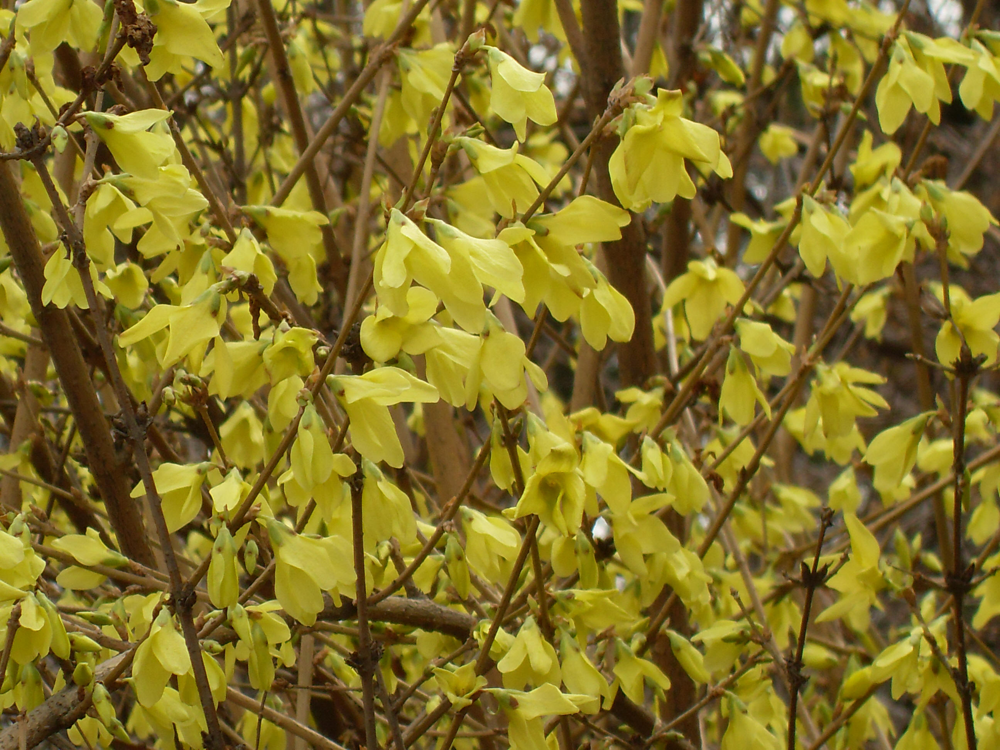

## 连翘

---

**拉丁名:**  _Forsythia suspensa(thunb.)vahl_

**科 属:** 木樨科 连翘属

**别 名:** 黄寿丹、黄花杆

**原产地:** 中国

**形  态:** 落叶灌木，高可达3米。干丛生，直立；枝开展，拱形下垂。单叶或有时为3小叶，对生，卵形、宽卵形或椭圆状卵形，长3～10厘米，无毛，端尖锐，基部圆形至宽楔形，缘有粗锯齿。花先叶开放，通常单生，稀3朵腋生；花冠黄色，4裂，倒卵状椭圆形。蒴果卵圆形，表面散生疣点。花期3～5月。

**西大分布地:** 北校区见于六、七号教学楼侧花坛及生命科学学院南侧。

**备注:** 连翘详细资料:首页下一页上一页【拉丁名】Forsythiasuspensa(thunb.)vahl【科属】木樨科连翘属【别名】黄寿丹、黄花杆【原产地】中国【形态】落叶灌木，高可达3米。干丛生，直立；枝开展，拱形下垂。单叶或有时为3小叶，对生，卵形、宽卵形或椭圆状卵形，长3～10厘米，无毛，端尖锐，基部圆形至宽楔形，缘有粗锯齿。花先叶开放，通常单生，稀3朵腋生；花冠黄色，4裂，倒卵状椭圆形。蒴果卵圆形，表面散生疣点。花期3～5月。【西大分布地】北校区见于六、七号教学楼侧花坛及生命科学学院南侧。备注;2009年3月6日摄于西北大学北校区六号教学楼北侧花坛。

 

