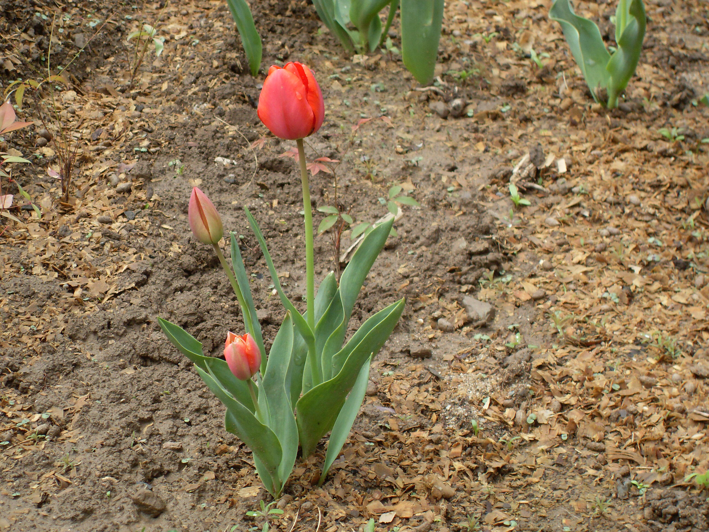
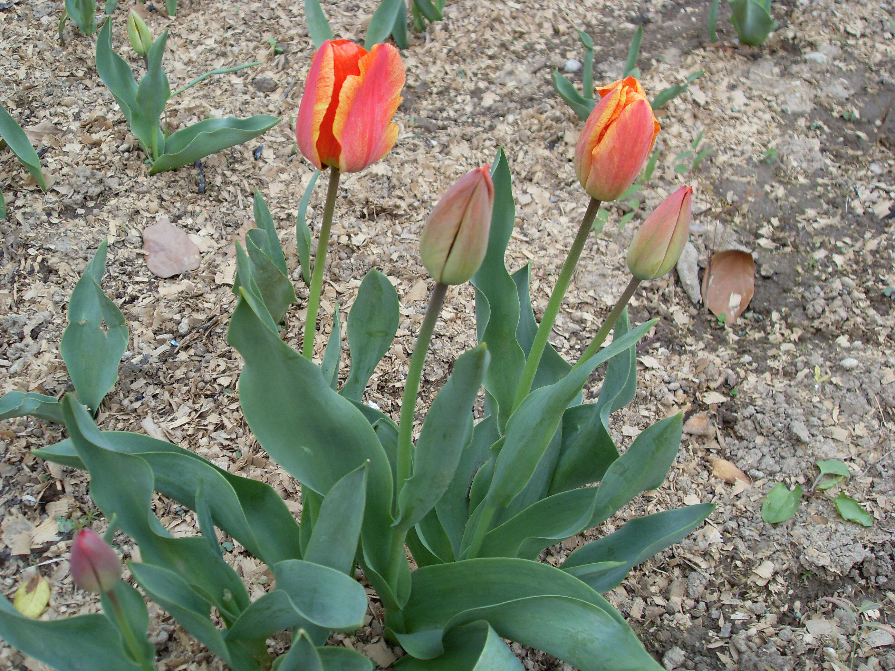

## 郁金香

---

**拉丁名:**  _Tulipa gesneriana Linn_

**科 属:** 百合科 郁金香属

**别 名:** 洋荷花、草麝香

**原产地:** 地中海沿岸，土耳其及小亚细亚

**形  态:** 具鳞茎的多年生草本，株高20～40厘米，直立性。叶3～5枚条状披针形或卵状披针形，花单多顶生，大型而艳丽；花被片6，红色或杂有黄色或白色，有时为白色或黄色，长5～7厘米，宽2～4厘米。6枚雄蕊等长，花丝无毛；无花柱，柱头增大呈鸡冠状。蒴果椭圆形或近球形，种子扁形，近三角形。花期4～5月。

**西大分布地:** 仅见于北校区西大花园内。

**备注:** 2009年3月28日生于西北大学北校区西大花园内。

 

 

