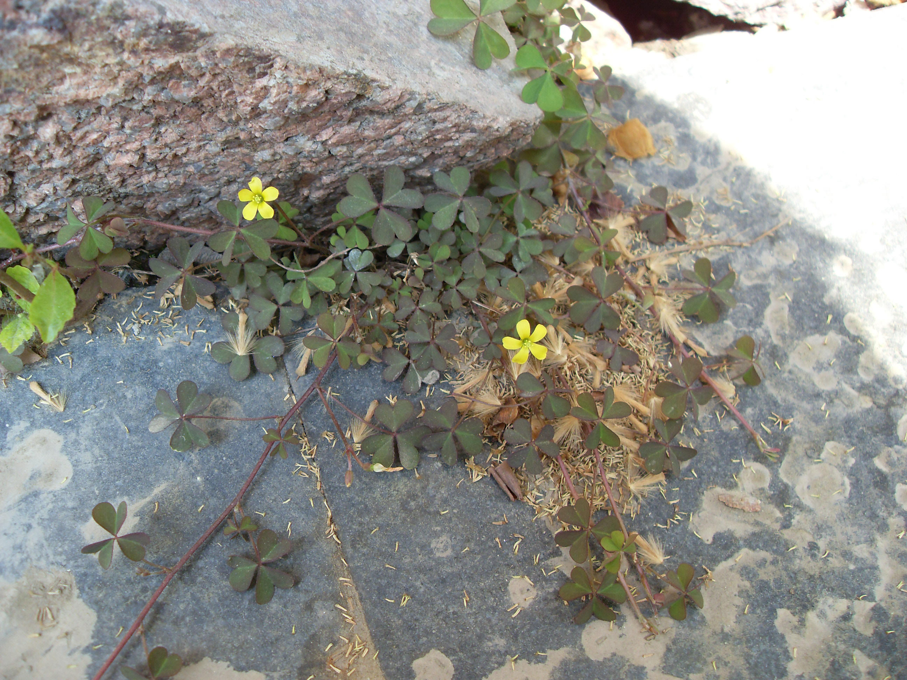

## 酢浆草

---

**拉丁名:**  _Oxalis corniculata Linn_

**科 属:** 酢浆草科 酢浆草属

**别 名:** 三块瓦、黄花酢浆草

**原产地:** 亚洲

**形  态:** 多年生草本，常有毛。茎直立或斜上，高10～25厘米。叶互生或簇生，为3出掌状复叶；小叶倒心形，无小叶柄；总叶柄细长。花黄色，1至数朵腋生为伞房花序；花瓣5，形小，略向外翻卷。蒴果圆柱状，先端尖锐，有毛，成熟时开裂，能将种子弹出，种子棕褐色，形小。花果期4～8月。

**西大分布地:** 常见杂草，三校区均有分布。

**备注:** 2009年4月7日摄于西北大学北校区地质系前雕像下石缝。

 

