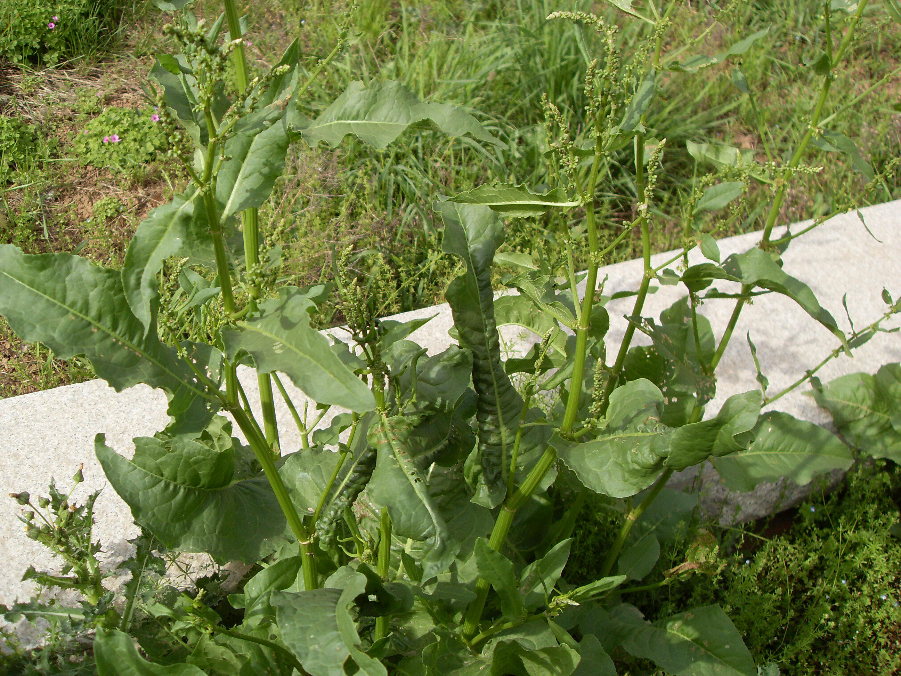

## 酸模

---

**拉丁名:**  _Rumex acetosa Linn_

**科 属:** 蓼科 酸模属

**别 名:** 山菠菜、牛舌头
【形  态】多年生草本。根状茎粗短，茎直立，高15～80厘米，
 细弱，不分枝。单叶互生，叶片质薄，椭圆形或披针状长圆形，
 长2.5～12厘米，宽1.5～4厘米，先端急尖或圆钝，基部箭形，
 全缘或微波状，两面均有粒状细点；叶柄长2～12厘米，基生叶
 具长柄，茎生叶由下向上，柄渐短，直至无柄；托叶鞘膜质，
 斜截形，顶端有睫毛，易破裂而早落花单性异株，圆锥花序顶生
 ，长可达40厘米，分枝疏而纤细，花簇间断着生，每一花簇有花
 数朵，生于短小鞘状苞片内，瘦果椭圆形，长约2毫米有3锐棱，
 两端尖，黑褐色，有光泽。花期3～5月；果期4～6月。
【西大分布地】三校区常见杂草，南校区多见于草坪与杂草丛中；
 北校区聚集于大操场东北处高台上。
备注：
    2009年4月24日摄于西北大学南校区待开发区。 　

**原产地:** 酸 模
详细资料： 首页 下一页 上一页
【拉丁名】Rumex acetosa Linn.
【科 属】蓼科 酸模属
【别 名】山菠菜、牛舌头

**形  态:** 多年生草本。根状茎粗短，茎直立，高15～80厘米，细弱，不分枝。单叶互生，叶片质薄，椭圆形或披针状长圆形，长2.5～12厘米，宽1.5～4厘米，先端急尖或圆钝，基部箭形，全缘或微波状，两面均有粒状细点；叶柄长2～12厘米，基生叶具长柄，茎生叶由下向上，柄渐短，直至无柄；托叶鞘膜质，斜截形，顶端有睫毛，易破裂而早落花单性异株，圆锥花序顶生，长可达40厘米，分枝疏而纤细，花簇间断着生，每一花簇有花数朵，生于短小鞘状苞片内，瘦果椭圆形，长约2毫米有3锐棱，两端尖，黑褐色，有光泽。花期3～5月；果期4～6月。

**西大分布地:** 三校区常见杂草，南校区多见于草坪与杂草丛中；北校区聚集于大操场东北处高台上。

**备注:** 2009年4月24日摄于西北大学南校区待开发区。　

 

