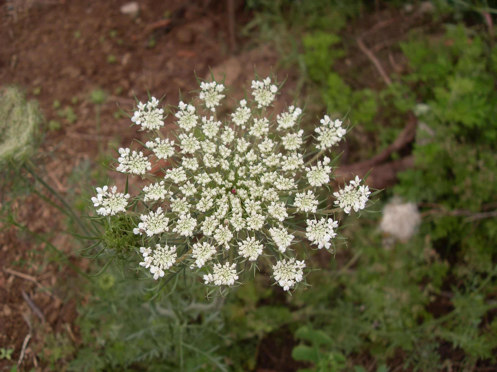

## 野胡萝卜

---

**拉丁名:**  _Daucus carota Linn_

**科 属:** 伞形科 胡萝卜属

**别 名:** 鹤虱草
【形  态】二年生草本，高15～120厘米。茎单生，全株有白色粗硬毛。
 基生叶薄膜质，长圆形，二至三回羽状全裂，末回裂片线形或披针形， 
 长2～15毫米，宽0.5～1.4毫米，顶端尖锐，有小尖头，光滑或有糙硬毛；
 叶柄长3～12厘米，茎生叶近无柄，有叶鞘，末回裂片小或细长。复伞形
 花序，花序梗长10～55厘米，有糙硬毛；总苞有多数苞片，呈叶状，羽状
 分裂，少有不裂的，裂片线形；伞辐多数，长2－7.5厘米，结果时外缘的
 伞辐向内弯曲；小总苞片5－7，线形，不分裂或2－3裂，边缘膜质，具纤
 毛；花通常白色，有时带淡红色；花柄不等长，长3－10毫米。果实圆卵形
 ，长3－4毫米，宽2毫米，棱上有白色刺毛。花期5－7月。
【西大分布地】见于南校区待开发区内。
备注：
    2009年5月17日摄于西北大学南校区待开发区内。

**原产地:** 野胡萝卜
详细资料： 首页 下一页 上一页
【拉丁名】Daucus carota Linn.
【科 属】伞形科 胡萝卜属
【别 名】鹤虱草

**形  态:** 二年生草本，高15～120厘米。茎单生，全株有白色粗硬毛。基生叶薄膜质，长圆形，二至三回羽状全裂，末回裂片线形或披针形，长2～15毫米，宽0.5～1.4毫米，顶端尖锐，有小尖头，光滑或有糙硬毛；叶柄长3～12厘米，茎生叶近无柄，有叶鞘，末回裂片小或细长。复伞形花序，花序梗长10～55厘米，有糙硬毛；总苞有多数苞片，呈叶状，羽状分裂，少有不裂的，裂片线形；伞辐多数，长2－7.5厘米，结果时外缘的伞辐向内弯曲；小总苞片5－7，线形，不分裂或2－3裂，边缘膜质，具纤毛；花通常白色，有时带淡红色；花柄不等长，长3－10毫米。果实圆卵形，长3－4毫米，宽2毫米，棱上有白色刺毛。花期5－7月。

**西大分布地:** 见于南校区待开发区内。

**备注:** 2009年5月17日摄于西北大学南校区待开发区内。

.JPG) 

 

