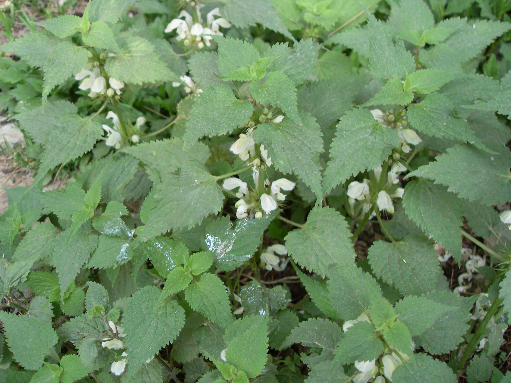

## 野芝麻

---

**拉丁名:**  _Lamium barbatum Sieb. et Zucc_

**科 属:** 唇形科 野芝麻属

**别 名:** 野油麻、山麦胡、地蚤
【形  态】多年生草本植物，茎高25一100厘米。茎四棱，具
 浅槽。叶卵状心形至卵状披针形，两面疏生柔毛；叶柄长1～
 7厘米。轮伞花序有花4一14，生在茎的上部叶腋，苞片线形，
 花冠白色，长2—3厘米，上唇直伸，下唇中裂片倒肾形，顶
 端深凹。小坚果倒卵形，有3棱。花果期3～6月。
【西大分布地】仅见于北校区西大花园内。
备注：
    2009年4月13日摄于西北大学北校区西大花园内。　

**原产地:** 野芝麻
详细资料： 首页 下一页 上一页 
【拉丁名】Lamium barbatum Sieb. et Zucc.
【科 属】唇形科 野芝麻属
【别 名】野油麻、山麦胡、地蚤

**形  态:** 多年生草本植物，茎高25一100厘米。茎四棱，具浅槽。叶卵状心形至卵状披针形，两面疏生柔毛；叶柄长1～7厘米。轮伞花序有花4一14，生在茎的上部叶腋，苞片线形，花冠白色，长2—3厘米，上唇直伸，下唇中裂片倒肾形，顶端深凹。小坚果倒卵形，有3棱。花果期3～6月。

**西大分布地:** 仅见于北校区西大花园内。

**备注:** 2009年4月13日摄于西北大学北校区西大花园内。　

.JPG) 

 

