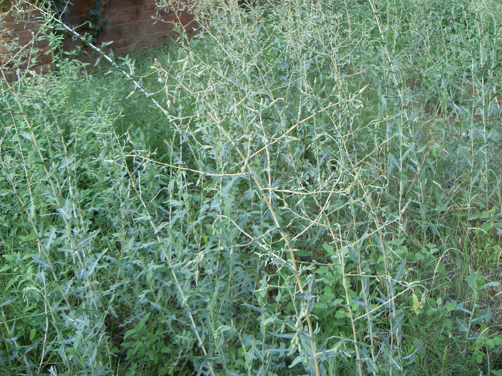

## 野莴苣

---

**拉丁名:**  _Lactuca seriola Torner _

**科 属:** 菊科 菊苣族 莴苣属

**别 名:** Lactuca seriola Torner
 【科  属】菊科 菊苣族 莴苣属
 【形  态】一年生或两年生草本，高达0.8米。茎直立，
  无毛，有细沟纹，上部多分枝。叶互生，长圆状披针形，
  先端急尖，基部无柄，呈箭状叶耳半抱茎，边缘倒向羽
  状半裂，有细皮刺状齿，表面绿色。头花多数，直立，
  排列成圆锥花序，全部舌状花。瘦果倒卵形，冠毛黄色。
  花果期7～9月。
 【西大分布地】常见杂草，见于三校区各处。
备注：
    2008年7月28日摄于西北大学北校区操场附近。

**原产地:** 野莴苣
详细资料： 首页 下一页 上一页
【拉丁名】Lactuca seriola Torner
【科 属】菊科 菊苣族 莴苣属
【形 态】一年生或两年生草本，高达0.8米。茎直立，
 无毛，有细沟纹，上部多分枝。叶互生，长圆状披针形，
 先端急尖，基部无柄，呈箭状叶耳半抱茎，边缘倒向羽
 状半裂，有细皮刺状齿，表面绿色。头花多数，直立，
 排列成圆锥花序，全部舌状花。瘦果倒卵形，冠毛黄色。
 花果期7～9月。
【西大分布地】常见杂草，见于三校区各处。
备注：
 2008年7月28日摄于西北大学北校区操场附近。

**形  态:** 一年生或两年生草本，高达0.8米。茎直立，无毛，有细沟纹，上部多分枝。叶互生，长圆状披针形，先端急尖，基部无柄，呈箭状叶耳半抱茎，边缘倒向羽状半裂，有细皮刺状齿，表面绿色。头花多数，直立，排列成圆锥花序，全部舌状花。瘦果倒卵形，冠毛黄色。花果期7～9月。

**西大分布地:** 常见杂草，见于三校区各处。

**备注:** 2008年7月28日摄于西北大学北校区操场附近。

.JPG) 

 

