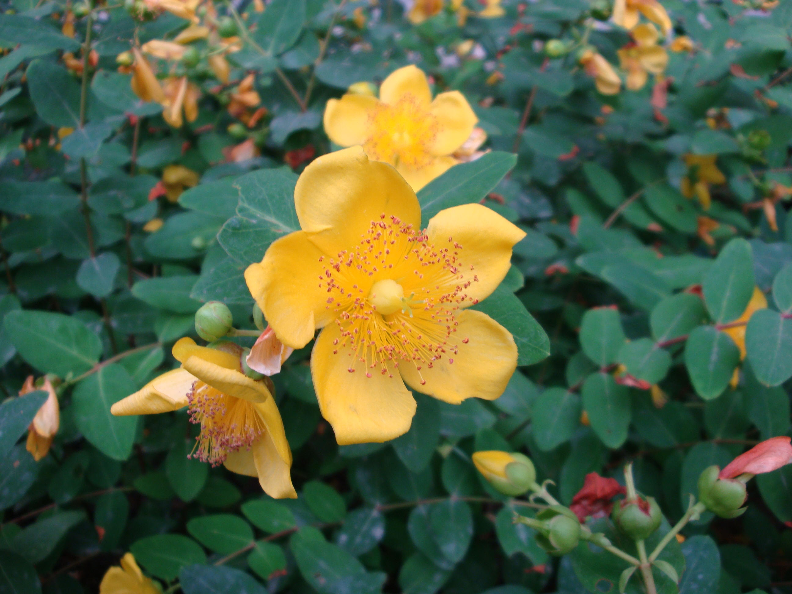

## 金丝梅

---

**拉丁名:**  _Hypericum patulum Thunb. ex Murray  _

**科 属:** 藤黄科 金丝桃属

**别 名:** 芒种花、云南连翘
 【原产地】中国
 【形  态】半常绿而披散的灌木，高达1米。小枝常成弧形
  ，红色或暗褐色。叶对生，卵形、长卵形或卵状披针形，
  长2.5～5厘米，先端圆钝或尖，基部渐狭或圆形，全缘，
  表面绿色，背面淡粉绿色，散步稀疏的油腺点，叶柄极端。
  花单生枝端，或成聚伞花序；花直径4～5厘米，花瓣5，金
  黄色；雄蕊多数，联合成5束。蒴果卵形，具宿存的萼。花
  果期5～10月。
 【西大分布地】南校区见于中央广场两侧楼下；
               桃园校区见于教工住宅区草坪。
备注：
    2009年6月17日摄于西北大学南校区中央广场东侧楼下。

**原产地:** 中国
【形 态】半常绿而披散的灌木，高达1米。小枝常成弧形
 ，红色或暗褐色。叶对生，卵形、长卵形或卵状披针形，
 长2.5～5厘米，先端圆钝或尖，基部渐狭或圆形，全缘，
 表面绿色，背面淡粉绿色，散步稀疏的油腺点，叶柄极端。
 花单生枝端，或成聚伞花序；花直径4～5厘米，花瓣5，金
 黄色；雄蕊多数，联合成5束。蒴果卵形，具宿存的萼。花
 果期5～10月。
【西大分布地】南校区见于中央广场两侧楼下；
 桃园校区见于教工住宅区草坪。
备注：
 2009年6月17日摄于西北大学南校区中央广场东侧楼下。

**形  态:** 半常绿而披散的灌木，高达1米。小枝常成弧形，红色或暗褐色。叶对生，卵形、长卵形或卵状披针形，长2.5～5厘米，先端圆钝或尖，基部渐狭或圆形，全缘，表面绿色，背面淡粉绿色，散步稀疏的油腺点，叶柄极端。花单生枝端，或成聚伞花序；花直径4～5厘米，花瓣5，金黄色；雄蕊多数，联合成5束。蒴果卵形，具宿存的萼。花果期5～10月。

**西大分布地:** 南校区见于中央广场两侧楼下； 桃园校区见于教工住宅区草坪。

**备注:** 2009年6月17日摄于西北大学南校区中央广场东侧楼下。

.JPG) 

 

