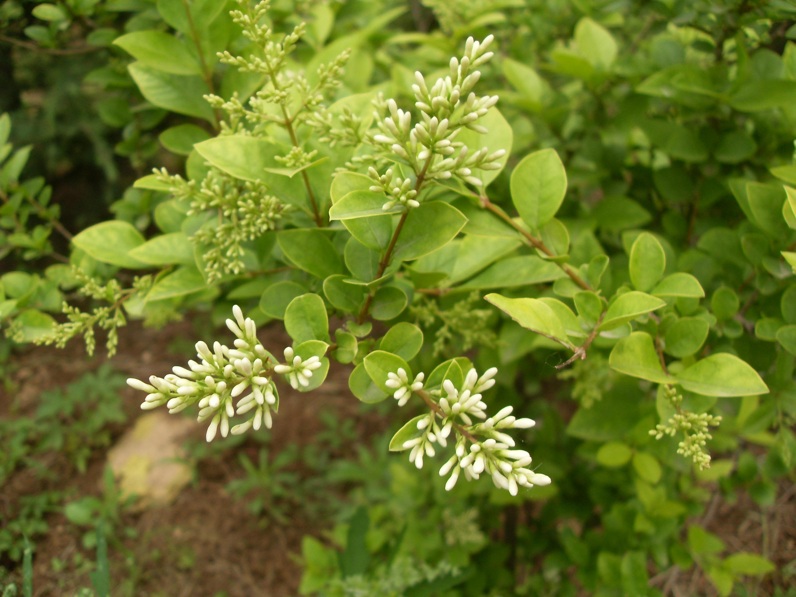

## 金叶女贞

---

**拉丁名:**  _Ligustrum vicaryi　Rehd_

**科 属:** 木犀科 女贞属

**别 名:** 黄叶女贞
【形  态】半常绿小灌木，株高2米至3米，冠幅1.5米至2米
 。单叶对生，椭圆形或卵状椭圆形，先端尖，全缘。初生叶
 片金黄色，色彩鲜明，老叶呈绿色，有光泽。圆锥花序顶生，
 小花白色，花期6月至7月，花后结椭圆形果实，成熟果实紫
 黑色。　
【西大分布地】见于三校区各花坛，多成片栽植，呈现黄绿色
 条带。
备注：
    2009年5月17日摄于西北大学南校区北门。　　

**原产地:** 金叶女贞
详细资料： 首页 下一页 上一页 
【拉丁名】Ligustrum vicaryi　Rehd.
【科 属】木犀科 女贞属
【别 名】黄叶女贞

**形  态:** 半常绿小灌木，株高2米至3米，冠幅1.5米至2米。单叶对生，椭圆形或卵状椭圆形，先端尖，全缘。初生叶片金黄色，色彩鲜明，老叶呈绿色，有光泽。圆锥花序顶生，小花白色，花期6月至7月，花后结椭圆形果实，成熟果实紫黑色。　

**西大分布地:** 见于三校区各花坛，多成片栽植，呈现黄绿色条带。

**备注:** 2009年5月17日摄于西北大学南校区北门。　　

.JPG) 

 

