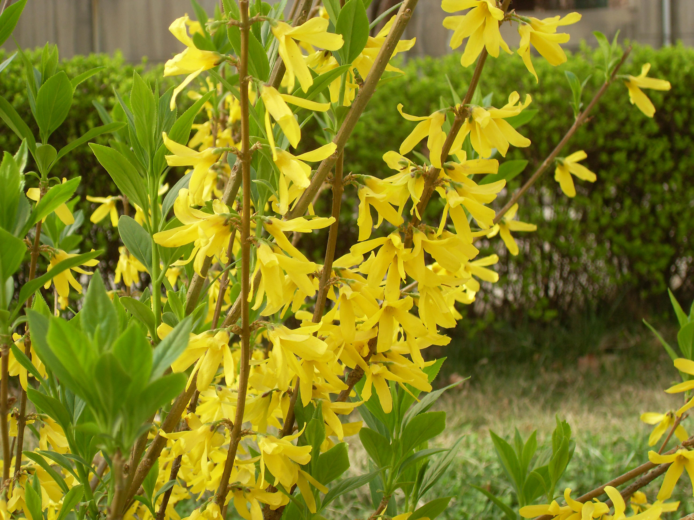

## 金钟花

---

**拉丁名:**  _Forsythia viridissima Lindl_

**科 属:** 木樨科 连翘属

**别 名:** 细叶连翘

**原产地:** 中国中部

**形  态:** 落叶灌木，高可达3米。枝条直立，小枝绿色呈四棱形。叶对生椭圆状矩圆形至披针形无毛，先端锐尖，基部楔形，上半部有粗锯齿。花无叶开放，1～3朵花腋生，花萼裂片4，卵形至椭圆形，有睫毛，约为花筒管长度之半；花深黄色，花冠裂片4，狭矩圆形，长1～1.5厘米，宽3～7厘米。蒴果卵形，长约1.5厘米，基部略圆。花期3～4月，果期5～6月。

**西大分布地:** 北校区见于地质系后草坪中。

**备注:** 2009年3月22日摄于西北大学北校区地质系后草坪。

 

