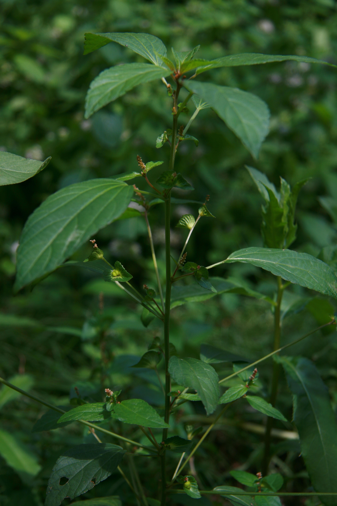

## 铁苋菜

---

**拉丁名:**  _Acalypha australis Linn_

**科 属:** 大戟科 铁苋菜属

**别 名:** 海蚌含珠、叶里藏珠
【形  态】一年生草本，高30～60cm，被柔毛。茎直立，多分枝
 。叶互生，椭圆状披针形，长2.5～8cm，宽1.5～3.5cm，顶端渐
 尖，基部楔形，两面有疏毛或无毛，叶脉基部3出；叶柄长，花序
 腋生，有叶状肾形苞片1～3，不分裂，合对如蚌；通常雄花序极
 短，着生在雌花序上部，雄花萼4裂，雄蕊8；雌花序生于苞片内。
 蒴果钝三棱形，淡褐色，有毛。种子黑色。花期5～7月，果期7～
 11月。
【西大分布地】三校区常见杂草，见于各处。
备注：
    该图为李智选老师2008年8月13日摄于西北大学北校区。

**原产地:** 铁苋菜
详细资料： 首页 下一页 上一页
【拉丁名】Acalypha australis Linn.
【科 属】大戟科 铁苋菜属
【别 名】海蚌含珠、叶里藏珠

**形  态:** 一年生草本，高30～60cm，被柔毛。茎直立，多分枝。叶互生，椭圆状披针形，长2.5～8cm，宽1.5～3.5cm，顶端渐尖，基部楔形，两面有疏毛或无毛，叶脉基部3出；叶柄长，花序腋生，有叶状肾形苞片1～3，不分裂，合对如蚌；通常雄花序极短，着生在雌花序上部，雄花萼4裂，雄蕊8；雌花序生于苞片内。蒴果钝三棱形，淡褐色，有毛。种子黑色。花期5～7月，果期7～11月。

**西大分布地:** 三校区常见杂草，见于各处。

**备注:** 该图为李智选老师2008年8月13日摄于西北大学北校区。

.JPG) 

 

