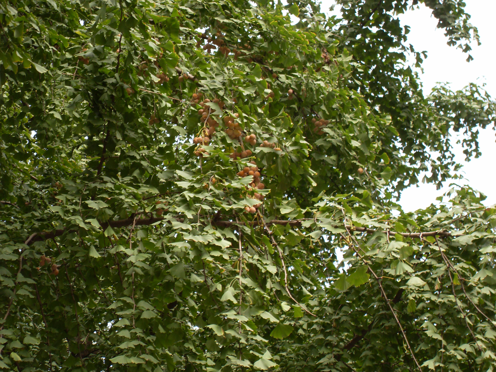

## 银杏

---

**拉丁名:**  _Ginkgo biloba Linn _

**科 属:** 银杏科 银杏属

**别 名:** 白果树、公孙树
 【原产地】中国
 【形  态】落叶大乔木。树干端直，树冠广卵形，树皮淡灰
  褐色，纵裂。枝有长枝和短枝两种类型。叶扇形，具长柄，
  在长枝上互生，短枝上簇生。雌雄异株。种子核果状，椭圆
  形或球形，外种皮肉质，黄色，具白粉。花期4～5月，果期9
  ～10月。
 【西大分布地】北校区见于六、七号教学楼前；南校区见于各处
  ；桃园校区见于教工住宅区草坪。
 备注：
     2008年9月22日摄于西北大学北校区七号教学楼前。

**原产地:** 中国
【形 态】落叶大乔木。树干端直，树冠广卵形，树皮淡灰
 褐色，纵裂。枝有长枝和短枝两种类型。叶扇形，具长柄，
 在长枝上互生，短枝上簇生。雌雄异株。种子核果状，椭圆
 形或球形，外种皮肉质，黄色，具白粉。花期4～5月，果期9
 ～10月。
【西大分布地】北校区见于六、七号教学楼前；南校区见于各处
 ；桃园校区见于教工住宅区草坪。
备注：
 2008年9月22日摄于西北大学北校区七号教学楼前。

**形  态:** 落叶大乔木。树干端直，树冠广卵形，树皮淡灰褐色，纵裂。枝有长枝和短枝两种类型。叶扇形，具长柄，在长枝上互生，短枝上簇生。雌雄异株。种子核果状，椭圆形或球形，外种皮肉质，黄色，具白粉。花期4～5月，果期9～10月。

**西大分布地:** 北校区见于六、七号教学楼前；南校区见于各处 ；桃园校区见于教工住宅区草坪。

**备注:** 2008年9月22日摄于西北大学北校区七号教学楼前。

 

