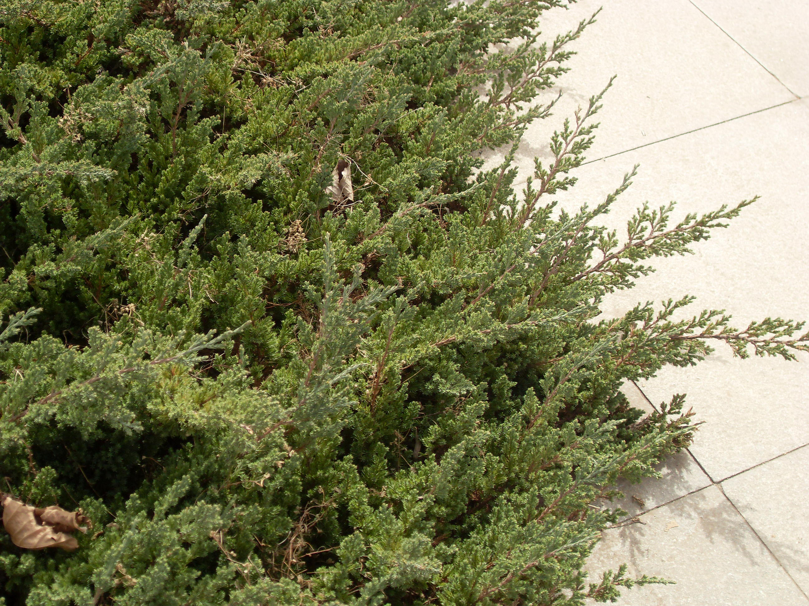

## 铺地柏

---

**拉丁名:**  _Sabina procumbens (Endl.) Iwata et Kusaka_

**科 属:** 柏科 圆柏属

**别 名:** 爬地柏

**原产地:** 日本

**形  态:** 匍匐小灌木，高达75厘米，冠幅逾2米，贴近地面伏生，叶全为刺叶，3叶交叉轮生。叶上面有2条白色气孔线，下面基部有2白色斑点，叶基下延生长，叶长6～8毫米，球果内含种子2～3。是常见的桩景材料。

**西大分布地:** 北校区见于图书馆左右；南校区见于北门喷泉广场左右。

**备注:** 2009年3月22日摄于西北大学南校区北门喷泉广场旁。

 

