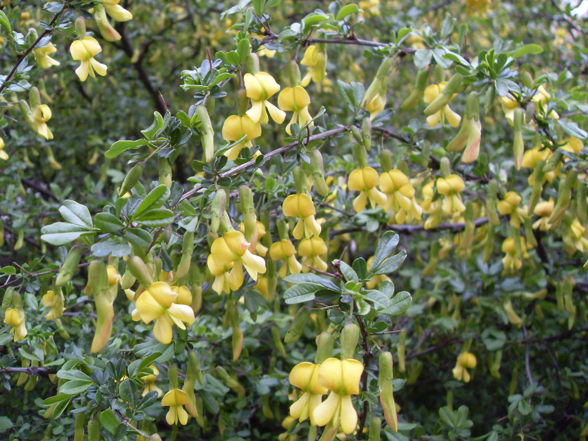

## 锦鸡儿

---

**拉丁名:**  _Caragana sinica （Buc.hoz) Rehd_

**科 属:** 豆科 锦鸡儿属

**别 名:** 金雀花、雀儿花

**原产地:** 中国

**形  态:** 灌木，高达1～2厘米。枝细长，小枝有棱，黄褐色或灰色。托叶针刺形。小叶4枚，上羽状或假掌状，面一对常较大，革质或硬纸质，倒卵形或长圆状倒卵形，长1～3.5厘米，宽5～15毫米，先端圆或微凹，具刺尖或无。花单生，萼钟状；花冠黄色带红色，凋谢时褐红色，长约3厘米；旗瓣狭倒卵形，翼瓣稍长于旗瓣，龙骨瓣宽钝。荚果圆柱形。花期4～5月，果期6～7月。

**西大分布地:** 仅见于北校区图书馆楼后东南侧。

**备注:** 2009年3月30日摄于西北大学北校区图书馆楼后东南侧。　

.JPG) 

 

