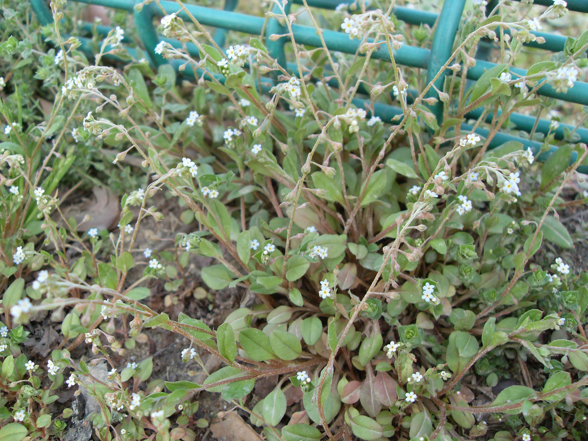
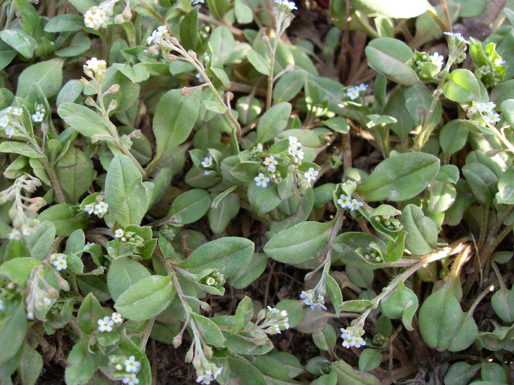

## 附地菜

---

**拉丁名:**  _Trigonotis peduncularis (Trev.) Benth_

**科 属:** 紫草科 附地菜属

**别 名:** 鸡肠草、地胡椒
【形  态】一年生草本，高5～30厘米。茎通常白基部分枝
 ,纤细，直立，或丛生，具平伏细毛。叶互生，匙形、椭
 圆形或披针形，长1～3厘米，宽5～20毫米，先端圆钝或
 或尖锐，基部狭窄，两面均具平伏粗毛；下部叶具短柄，
 上部叶无柄。总状花序顶生，细长，不具苞片；花通常生
 于花序的一侧，有柄，长3～6毫米；花冠蓝色，长约1.5
 毫米，5裂，裂片卵圆形，先端圆钝；小坚果三角状四边
 形，具细毛，少有光滑，有小柄。花期5～6月。
【西大分布地】早春常见杂草，三校区均有分布，多见于
 被阴的草丛中。
备注：
    2009年3月23日摄于西北大学北校区网球场围栏边。
　

**原产地:** 附地菜
详细资料： 首页 下一页 上一页
【拉丁名】Trigonotis peduncularis (Trev.) Benth.
【科 属】紫草科 附地菜属
【别 名】鸡肠草、地胡椒

**形  态:** 一年生草本，高5～30厘米。茎通常白基部分枝,纤细，直立，或丛生，具平伏细毛。叶互生，匙形、椭圆形或披针形，长1～3厘米，宽5～20毫米，先端圆钝或或尖锐，基部狭窄，两面均具平伏粗毛；下部叶具短柄，上部叶无柄。总状花序顶生，细长，不具苞片；花通常生于花序的一侧，有柄，长3～6毫米；花冠蓝色，长约1.5毫米，5裂，裂片卵圆形，先端圆钝；小坚果三角状四边形，具细毛，少有光滑，有小柄。花期5～6月。

**西大分布地:** 早春常见杂草，三校区均有分布，多见于被阴的草丛中。

**备注:** 2009年3月23日摄于西北大学北校区网球场围栏边。　

 

 

