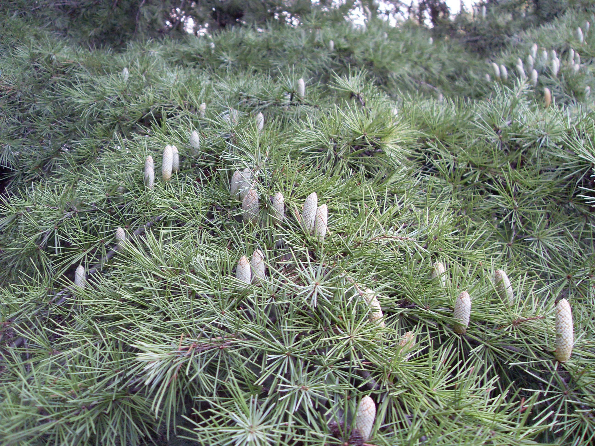
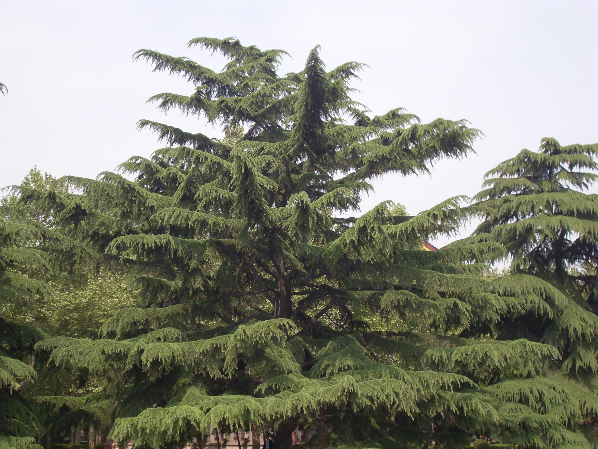

## 雪松

---

**拉丁名:**  _Cedrus deodara (Roxb.) G.Don_

**科 属:** 松科 雪松属

**别 名:** 喜马拉雅雪松

**原产地:** 喜马拉雅山西部及昆仑山区

**形  态:** 常绿大乔木，高达50米以上。主干端直，大致不规则轮生，平展，小枝微下垂，下部枝条近地面，形成塔形树冠。树皮灰褐色，幼时光滑，老年后则裂为鳞片状剥落。叶针形，蓝绿色，长2.5～5厘米，5针一束，先端尖，在长枝上螺旋散生，在短枝上簇生。雌雄异株；雄球花长卵形或椭圆状卵形，黄色，早放；雌球花卵圆形，紫红色。花期10～11月。球果椭圆状卵形，形大直立，下年10月成熟。　　　

**西大分布地:** 成年大树见于北校区，多聚集于图书馆前草坪四周及生命科学学院四周 南校区与桃园校区也在各处栽植。 

**备注:** 上图为雪松全株景观，2009年4月17日摄于西北大学北校区图书馆前草坪边；下图为雪松雄球花，2008年10月25日摄于西北大学北校区西门处花坛。

 

 

