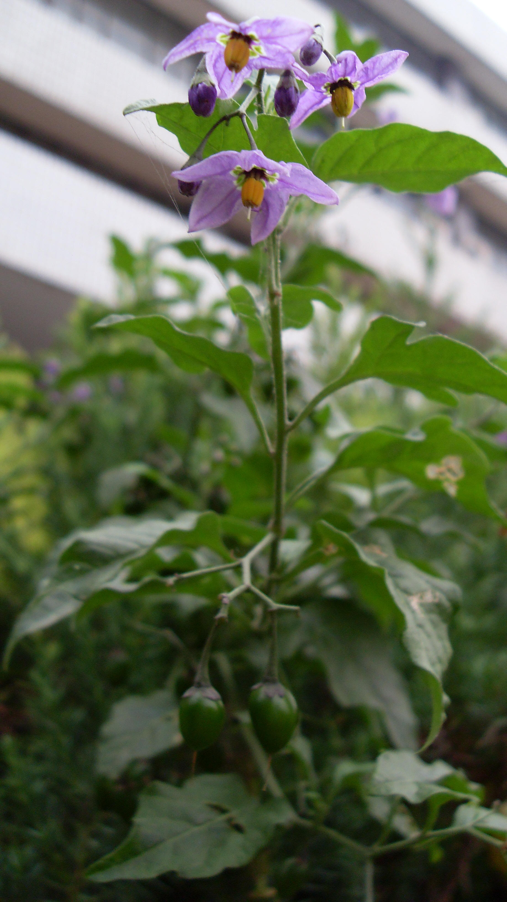
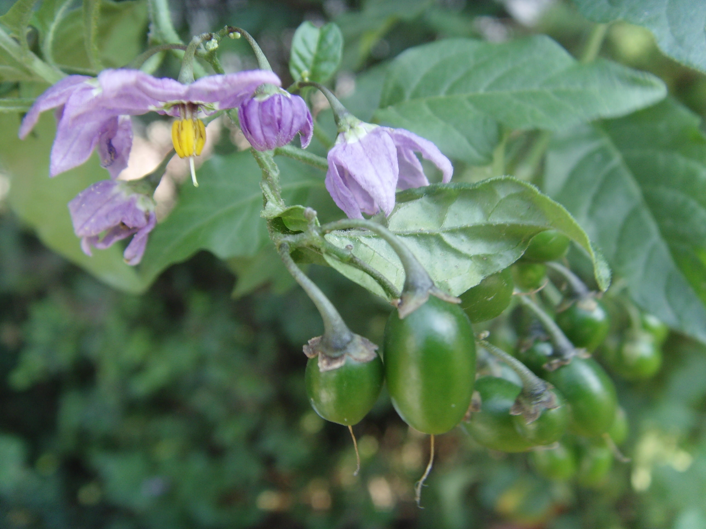

## 青杞

---

**拉丁名:**  _Solanum septemlobum Bunge_

**科 属:** 茄科 茄属

**别 名:** 野茄 

**原产地:** 不详

**形  态:** 直立草本或灌木状，茎有棱角，被白色分节弯卷的短柔毛至近无毛，叶互生卵形，长3～7厘米，先端钝，基部楔形。二歧聚伞花序，萼小，杯状，5裂；花冠青紫色，5深裂，裂片长圆形，开放时常向外反折，花期6～10月。浆果近球状，成熟时红色，果期8～11月。

**西大分布地:** 三校区均有分布，常见于林下杂草丛中。　

**备注:** 2008年10月12日摄于西北大学北校区化工学院北草坪上。

 

 

