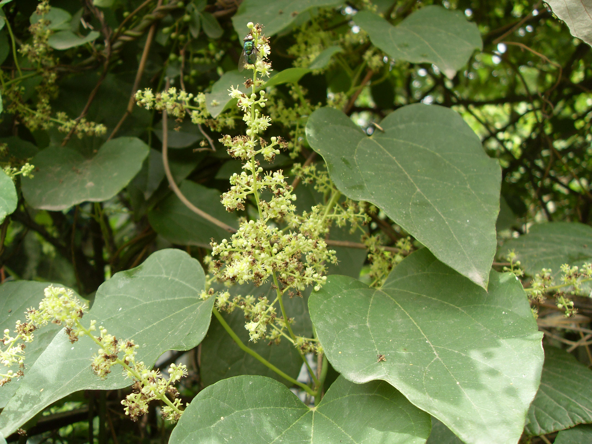

## 风龙

---

**拉丁名:**  _Sinomenium acutum (Thunb.) Rehd.et Wila_

**科 属:** 防己科 风龙属

**别 名:** 青藤、汉防己、毛防己

**原产地:** 中国、日本

**形  态:** 落叶木质大藤本。茎圆柱形，有细纵条纹，灰绿色，平滑或有微毛。叶革质或纸质，宽卵形或圆形，长宽6～15厘米，先端锐尖或渐尖，基部心形，全缘或3浅裂，表面绿色有短毛，背面灰白色，密生短柔毛。圆锥花序腋生，长8～20厘米；花小，淡绿色。核果扁球形，红色之紫黑色。花期6月，果期7～8月。

**西大分布地:** 见于北校区生命科学学院南侧及西大花园内。

**备注:** 2009年5月31日摄于西北大学北校区西大花园内。

 

