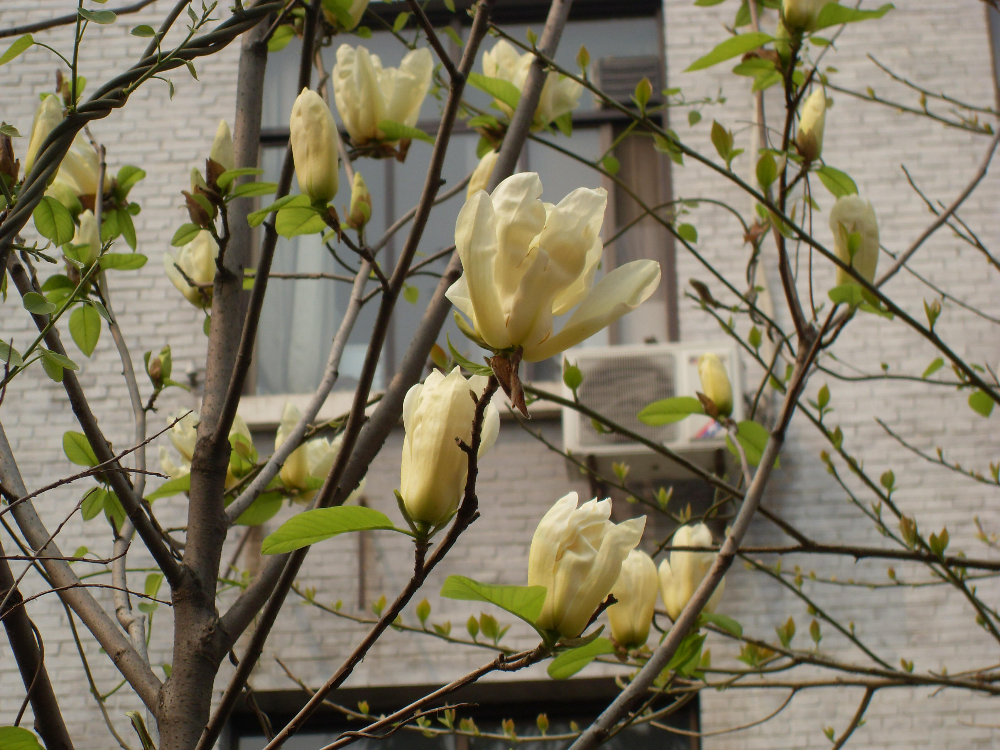

## 飞黄玉兰

---

**拉丁名:**  _Magnolia denudate cv. Fe Wang_

**科 属:** 木兰科 木兰属

**特 注:** 飞黄玉兰为一园艺品种。

**别 名:** 黄玉兰
【特  注】飞黄玉兰为一园艺品种。
【形  态】黄玉兰为花色金黄色的落叶小灌木，在初开时，花被片会
 会呈现淡黄色，基部色深，呈现黄绿色，盛开后就成为纯白色，此种
 开黄色花的玉兰品种是白玉兰的一个栽培变种。黄玉兰是王飞罡选育
 的极为罕见的观赏花木之一，它高1至1.5米，冠幅0.8米，春末开花。
 较一般玉兰花开迟。
【西大分布地】仅见于生命科学学院南门口行道旁。
备注：
    2009年3月31摄于西北大学北校区生命科学学院南门口行道旁。

**原产地:** 飞黄玉兰
详细资料： 首页 下一页 上一页
【拉丁名】Magnolia denudate cv. Fe Wang
【科 属】木兰科 木兰属
【别 名】黄玉兰
【特 注】飞黄玉兰为一园艺品种。

**形  态:** 黄玉兰为花色金黄色的落叶小灌木，在初开时，花被片会会呈现淡黄色，基部色深，呈现黄绿色，盛开后就成为纯白色，此种开黄色花的玉兰品种是白玉兰的一个栽培变种。黄玉兰是王飞罡选育的极为罕见的观赏花木之一，它高1至1.5米，冠幅0.8米，春末开花。较一般玉兰花开迟。

**西大分布地:** 仅见于生命科学学院南门口行道旁。

**备注:** 2009年3月31摄于西北大学北校区生命科学学院南门口行道旁。

.JPG) 

 

