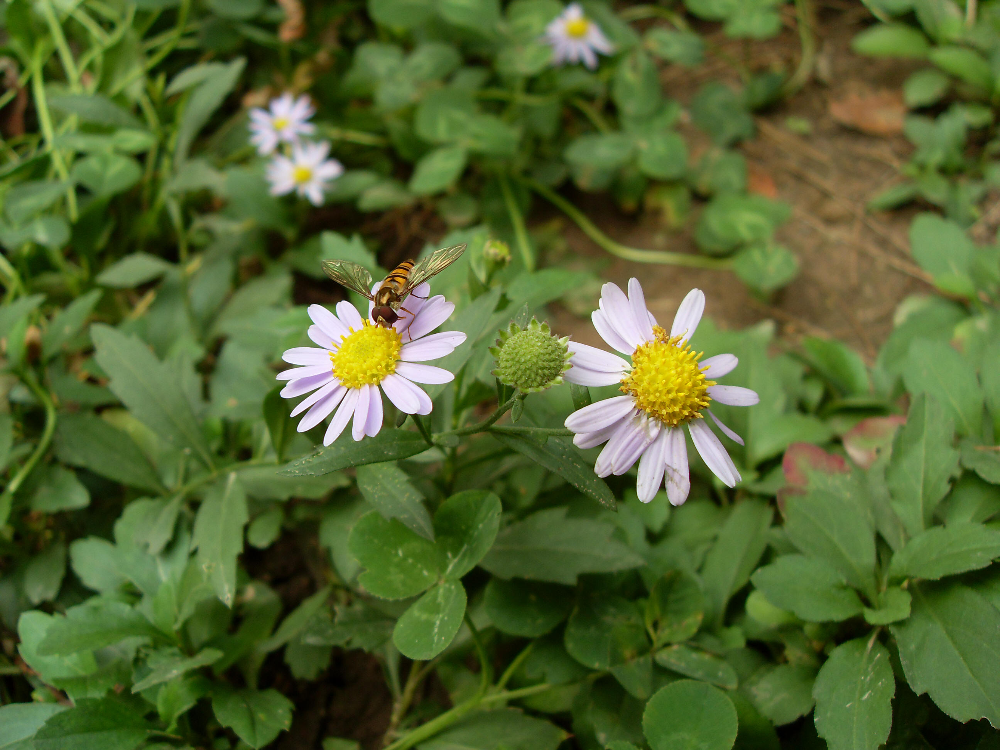

## 马兰

---

**拉丁名:**  _Kalimeris indica (Linn.) Sch.-Bip _

**科 属:** 菊科 紫菀族 马兰属

**别 名:** 鸡儿肠
 【形  态】多年生草本，高30～70厘米。茎直立，叶互生
  ，薄草质，倒披针形或倒卵状长圆形，先端钝或尖，基部
  渐狭无叶柄，边缘有疏粗齿或羽状披针形尖裂片，上部叶
  小，全缘。头状花序直径2.5厘米，单生于枝顶，排列成疏
  伞房状；舌状花1层，舌片淡紫色，筒状花多数。瘦果倒卵
  状长圆形，极扁，褐色。花果期9～11月。
 【西大分布地】常见于北校区各处。
备注：
    2008年10月12日摄于西北大学北校区行政楼前。
　

**原产地:** 马 兰
详细资料： 首页 下一页 上一页 
【拉丁名】Kalimeris indica (Linn.) Sch.-Bip.
【科 属】菊科 紫菀族 马兰属
【别 名】鸡儿肠
【形 态】多年生草本，高30～70厘米。茎直立，叶互生
 ，薄草质，倒披针形或倒卵状长圆形，先端钝或尖，基部
 渐狭无叶柄，边缘有疏粗齿或羽状披针形尖裂片，上部叶
 小，全缘。头状花序直径2.5厘米，单生于枝顶，排列成疏
 伞房状；舌状花1层，舌片淡紫色，筒状花多数。瘦果倒卵
 状长圆形，极扁，褐色。花果期9～11月。
【西大分布地】常见于北校区各处。
备注：
 2008年10月12日摄于西北大学北校区行政楼前。
　

**形  态:** 多年生草本，高30～70厘米。茎直立，叶互生，薄草质，倒披针形或倒卵状长圆形，先端钝或尖，基部渐狭无叶柄，边缘有疏粗齿或羽状披针形尖裂片，上部叶小，全缘。头状花序直径2.5厘米，单生于枝顶，排列成疏伞房状；舌状花1层，舌片淡紫色，筒状花多数。瘦果倒卵状长圆形，极扁，褐色。花果期9～11月。

**西大分布地:** 常见于北校区各处。

**备注:** 2008年10月12日摄于西北大学北校区行政楼前。　

 

