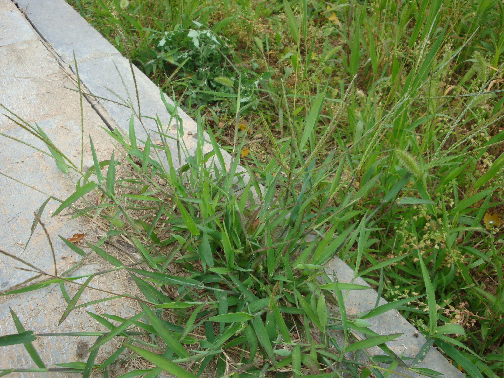

## 马唐

---

**拉丁名:**  _Digitaria sanguinalis (Linn.) Scop _

**科 属:** 禾本科 马唐属

**别 名:** 抓地草、须草
 【形  态】一年生草本，秆高30～60厘米。基部多倾斜生长
  ，着土后节处易生根。叶鞘松弛；叶舌膜质，黄棕色，长1
  ～3毫米，先端钝圆；叶片线状披针形，长3～7厘米，宽3
  ～9毫米，边缘略厚而粗糙。总状花序4～12枚生于茎顶，互
  生或成指状排列，基部近于轮生。小穗披针形，长3毫米。
  花期6～8月，果期9～10月。
 【西大分布地】常见杂草，见于三校区各处。
备注：
    2009年6月17日摄于西北大学南校区待开发区。

**原产地:** 马 唐
详细资料： 首页 下一页 上一页
【拉丁名】Digitaria sanguinalis (Linn.) Scop.
【科 属】禾本科 马唐属
【别 名】抓地草、须草
 【形 态】一年生草本，秆高30～60厘米。基部多倾斜生长
 ，着土后节处易生根。叶鞘松弛；叶舌膜质，黄棕色，长1
 ～3毫米，先端钝圆；叶片线状披针形，长3～7厘米，宽3
 ～9毫米，边缘略厚而粗糙。总状花序4～12枚生于茎顶，互
 生或成指状排列，基部近于轮生。小穗披针形，长3毫米。
 花期6～8月，果期9～10月。
【西大分布地】常见杂草，见于三校区各处。
备注：
 2009年6月17日摄于西北大学南校区待开发区。

**形  态:** 一年生草本，秆高30～60厘米。基部多倾斜生长，着土后节处易生根。叶鞘松弛；叶舌膜质，黄棕色，长1～3毫米，先端钝圆；叶片线状披针形，长3～7厘米，宽3～9毫米，边缘略厚而粗糙。总状花序4～12枚生于茎顶，互生或成指状排列，基部近于轮生。小穗披针形，长3毫米。花期6～8月，果期9～10月。

**西大分布地:** 常见杂草，见于三校区各处。

**备注:** 2009年6月17日摄于西北大学南校区待开发区。

.JPG) 

 

