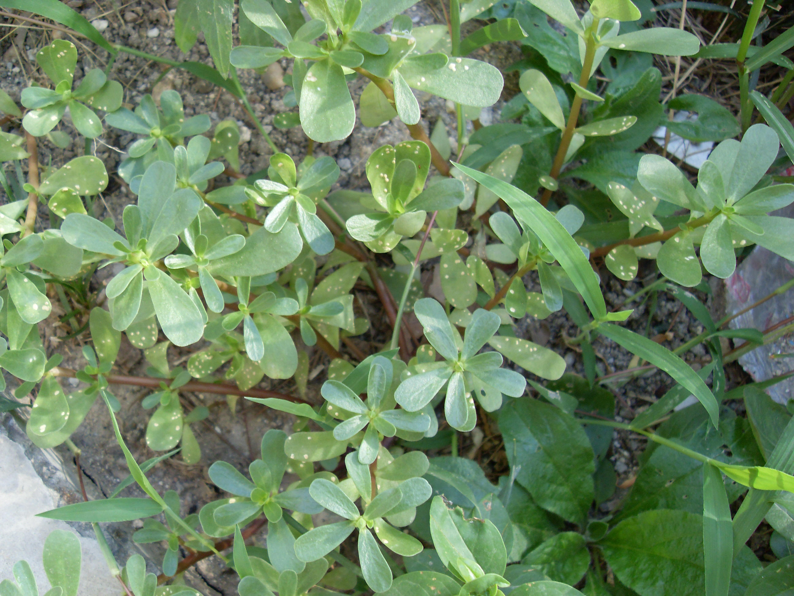

## 马齿苋

---

**拉丁名:**  _Portulaca oleracea Linn _

**科 属:** 马齿苋科 马齿苋属

**别 名:** 蚂蚱菜、麻子菜
 【形  态】一年生肉质草本，全体平滑无毛。茎平卧或斜上
  ，铺散，淡绿色或粉红色，长达30厘米。叶互生，叶片肥厚
  多汁，倒卵形，长1～3厘米，宽0.5～1.5厘米，先端圆钝或
  平截，有时微凹，基部楔形，全缘，叶柄粗短。花通常3～5
  朵簇生枝端，午时盛开，直径5毫米；花瓣5，黄色。蒴果卵
  球形，长约5毫米，盖裂，种子多数，种子细小，黑褐色，有
  光泽。花果期5～9月。
 【西大分布地】三校区常见杂草，见于各处。
备注：
    2009年7月5日摄于西北大学北校区生命科学学院楼后。

**原产地:** 马齿苋
详细资料： 首页 下一页 上一页
【拉丁名】Portulaca oleracea Linn.
【科 属】马齿苋科 马齿苋属
【别 名】蚂蚱菜、麻子菜
【形 态】一年生肉质草本，全体平滑无毛。茎平卧或斜上
 ，铺散，淡绿色或粉红色，长达30厘米。叶互生，叶片肥厚
 多汁，倒卵形，长1～3厘米，宽0.5～1.5厘米，先端圆钝或
 平截，有时微凹，基部楔形，全缘，叶柄粗短。花通常3～5
 朵簇生枝端，午时盛开，直径5毫米；花瓣5，黄色。蒴果卵
 球形，长约5毫米，盖裂，种子多数，种子细小，黑褐色，有
 光泽。花果期5～9月。
【西大分布地】三校区常见杂草，见于各处。
备注：
 2009年7月5日摄于西北大学北校区生命科学学院楼后。

**形  态:** 一年生肉质草本，全体平滑无毛。茎平卧或斜上，铺散，淡绿色或粉红色，长达30厘米。叶互生，叶片肥厚多汁，倒卵形，长1～3厘米，宽0.5～1.5厘米，先端圆钝或平截，有时微凹，基部楔形，全缘，叶柄粗短。花通常3～5朵簇生枝端，午时盛开，直径5毫米；花瓣5，黄色。蒴果卵球形，长约5毫米，盖裂，种子多数，种子细小，黑褐色，有光泽。花果期5～9月。

**西大分布地:** 三校区常见杂草，见于各处。

**备注:** 2009年7月5日摄于西北大学北校区生命科学学院楼后。

 

