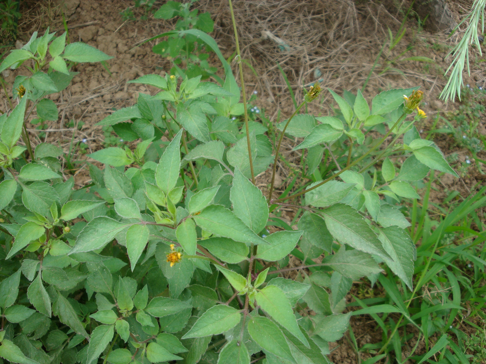

## 鬼针草

---

**拉丁名:**  _Bidens pilosa Linn _

**科 属:** 菊科 向日葵族 鬼针草属

**别 名:** 三叶鬼针草
 【形  态】一年生草本，高30～100厘米。茎直立，钝四棱形
  。茎下部叶较小，3裂或不分裂，在开花前枯萎；中部叶3出，
  两侧小叶椭圆形或卵状椭圆形，有短柄，边缘有锯齿，顶生
  小叶较大，长椭圆形或卵状长圆形。头状花序直径8～9毫米
  ；无舌状花，盘花筒状。瘦果黑色、线形，略扁，有棱，上
  部有倒钩刺。花期7～10月，果期9～11月。
 【西大分布地】南校区常见杂草，见于荒草从中。
备注：
    2009年6月17日摄于西北大学南校区待开发区。

**原产地:** 鬼针草
详细资料： 首页 下一页 上一页 
【拉丁名】Bidens pilosa Linn.
【科 属】菊科 向日葵族 鬼针草属
【别 名】三叶鬼针草
【形 态】一年生草本，高30～100厘米。茎直立，钝四棱形
 。茎下部叶较小，3裂或不分裂，在开花前枯萎；中部叶3出，
 两侧小叶椭圆形或卵状椭圆形，有短柄，边缘有锯齿，顶生
 小叶较大，长椭圆形或卵状长圆形。头状花序直径8～9毫米
 ；无舌状花，盘花筒状。瘦果黑色、线形，略扁，有棱，上
 部有倒钩刺。花期7～10月，果期9～11月。
【西大分布地】南校区常见杂草，见于荒草从中。
备注：
 2009年6月17日摄于西北大学南校区待开发区。

**形  态:** 一年生草本，高30～100厘米。茎直立，钝四棱形。茎下部叶较小，3裂或不分裂，在开花前枯萎；中部叶3出，两侧小叶椭圆形或卵状椭圆形，有短柄，边缘有锯齿，顶生小叶较大，长椭圆形或卵状长圆形。头状花序直径8～9毫米；无舌状花，盘花筒状。瘦果黑色、线形，略扁，有棱，上部有倒钩刺。花期7～10月，果期9～11月。

**西大分布地:** 南校区常见杂草，见于荒草从中。

**备注:** 2009年6月17日摄于西北大学南校区待开发区。

.JPG) 

 

