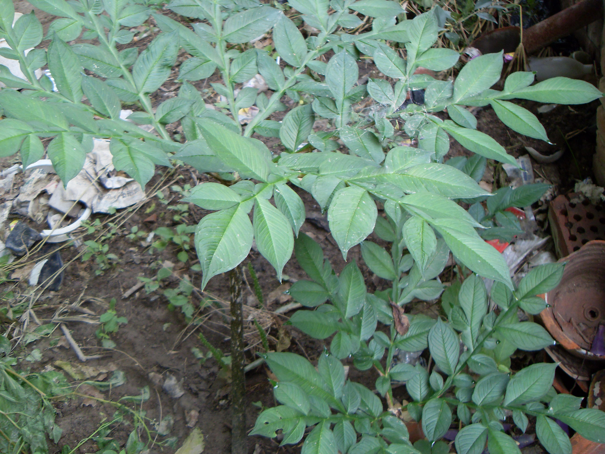

## 魔芋

---

**拉丁名:**  _Amorphophallus rivieri Durieu _

**科 属:** 天南星科 魔芋属 

**别 名:** 蒟蒻（jǔruò）
 【原产地】中国
 【形  态】多年生草本，块茎扁圆形。先花后叶，叶1枚，
  具3小叶，小叶2歧分叉，裂片再羽状深裂，小裂片椭圆
  形至卵状矩圆形，长2～8厘米，基部楔形，一侧下延于
  羽轴成狭翅；叶柄长40～80厘米，青绿色。花葶长50～
  70厘米；佛焰苞卵形，下部漏斗状筒形 ，外面绿色而
  有紫绿色斑点，里面紫黑色；肉穗花序近2倍长于佛焰
  苞，下部雌花，上部雄花。浆果。
 【西大分布地】仅见于北校区西大花园内。
备注：
    2009年7月28日摄于西北大学北校区西大花园内。
　

**原产地:** 中国
【形 态】多年生草本，块茎扁圆形。先花后叶，叶1枚，
 具3小叶，小叶2歧分叉，裂片再羽状深裂，小裂片椭圆
 形至卵状矩圆形，长2～8厘米，基部楔形，一侧下延于
 羽轴成狭翅；叶柄长40～80厘米，青绿色。花葶长50～
 70厘米；佛焰苞卵形，下部漏斗状筒形 ，外面绿色而
 有紫绿色斑点，里面紫黑色；肉穗花序近2倍长于佛焰
 苞，下部雌花，上部雄花。浆果。
【西大分布地】仅见于北校区西大花园内。
备注：
 2009年7月28日摄于西北大学北校区西大花园内。
　

**形  态:** 多年生草本，块茎扁圆形。先花后叶，叶1枚，具3小叶，小叶2歧分叉，裂片再羽状深裂，小裂片椭圆形至卵状矩圆形，长2～8厘米，基部楔形，一侧下延于羽轴成狭翅；叶柄长40～80厘米，青绿色。花葶长50～70厘米；佛焰苞卵形，下部漏斗状筒形，外面绿色而有紫绿色斑点，里面紫黑色；肉穗花序近2倍长于佛焰苞，下部雌花，上部雄花。浆果。

**西大分布地:** 仅见于北校区西大花园内。

**备注:** 2009年7月28日摄于西北大学北校区西大花园内。　

.JPG) 

 

