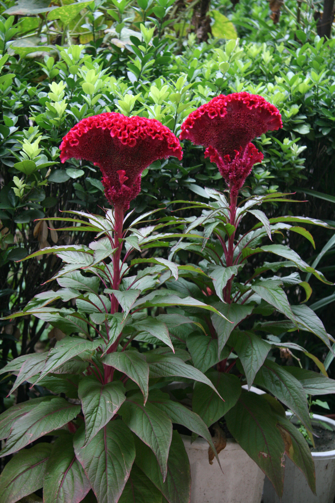

## 鸡冠花

---

**拉丁名:**  _Celosia cristata Linn_

**科 属:** 莧科 青葙属

**别 名:** 老来红、鸡公花

**原产地:** 非洲，美洲热带和印度

**形  态:** 一年生草本，株高20-150厘米，茎直立粗壮，叶互生，长卵形或卵状披针形，肉穗丈花序顶生，呈扇形、肾形、扁球形等，自然花期夏、秋至霜降。常用种子繁殖，生长期喜高温，全光照且空气干燥的环境，较耐旱不耐寒，繁殖能力强。秋季花盛开时采收，晒干。叶卵状披针形至披针形，全缘。花序顶生及腋生，扁平鸡冠形。花有白、淡黄、金黄、淡红、火红、紫红、棕红、橙红等色。胞果卵形，种子黑色有光泽。

**西大分布地:** 见于桃园校区家属区，南北校区偶有栽培。

**备注:** 给图为李智选老师2008年9月16日摄于西北大学桃园校区。

.JPG) 

 

