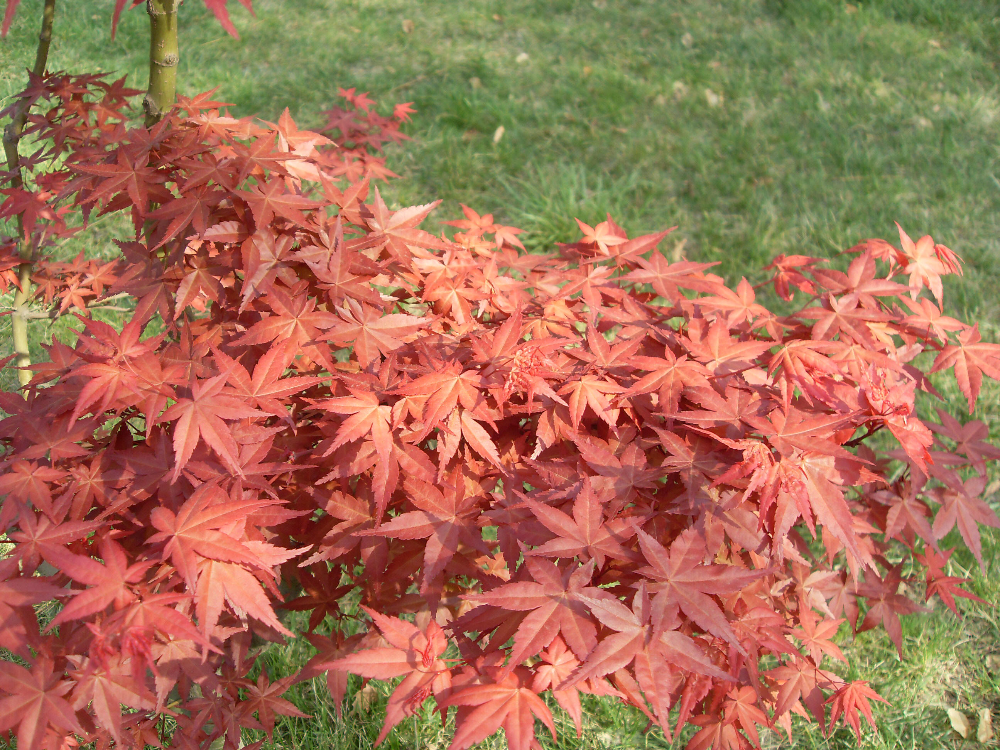

## 鸡爪槭

---

**拉丁名:**  _Acer palmatum Thunb.var.dissectum (Thunb.) K.Koch_

**科 属:** 槭属科 槭属

**别 名:** 羽毛枫、红枫

**原产地:** 中国、日本

**形  态:** 落叶小乔木。叶紫棕色，7～11深裂，裂片线状披针形，先端狭长，尖锐，底部狭窄似柄状，缘部又深裂为多数小羽片，小羽片具细尖齿。小坚果扁平，卵圆形，果翅矩圆形，成锐角开展。

**西大分布地:** 见于三校区各草坪，多作孤植树。

**备注:** 2009年4月13日摄于西北大学北校区地质系楼后。

 

