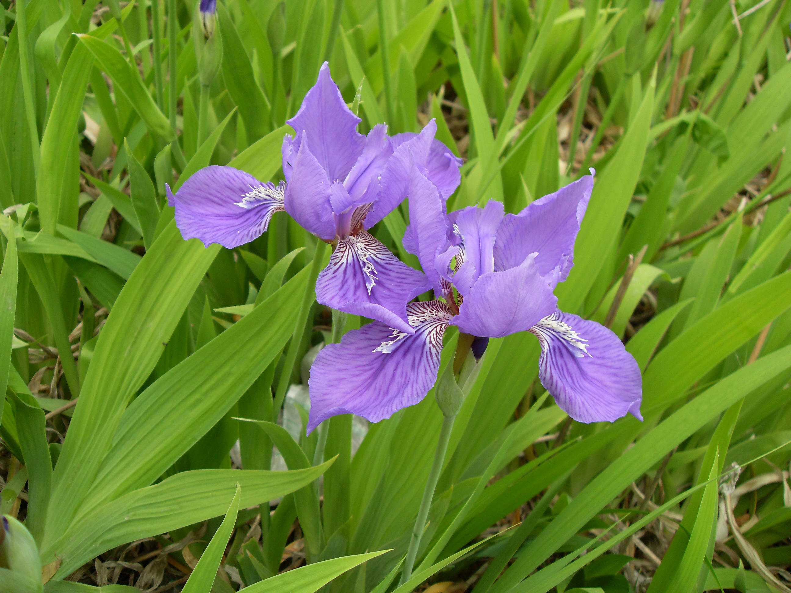
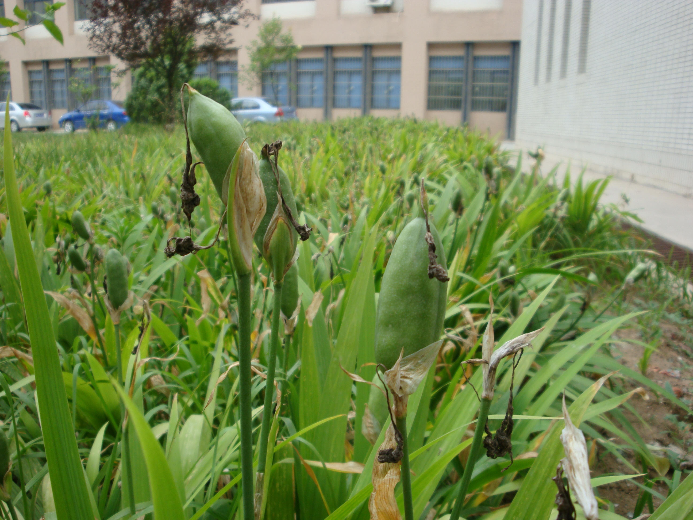

## 鸢尾

---

**拉丁名:**  _Iris tectorum Maxim_

**科 属:** 鸢尾科 鸢尾属

**别 名:** 扁竹花、紫蝴蝶

**原产地:** 中国及日本

**形  态:** 多年生宿根性直立草本，高约30-50厘米。根状茎匍匐多节，粗而节间短，浅黄色。叶为渐尖状剑形，宽2-4厘米，长30-45厘米，质薄，淡绿色，呈二纵列交互排列，基部互相包叠。春至初夏开花，总状花序1-2枝，每枝有花2-3朵；花蝶形，花冠蓝紫色或紫白色，径约10厘米，外3枚较大，圆形下垂；内3枚较小，倒圆形；外列花被有深紫斑点，中央面有一行鸡冠状白色带紫纹突起。蒴果长椭圆形，有6稜。花期4～6月，果期6～8月。　　　　　

**西大分布地:** 南校区集中分布在中央广场左右及报告厅楼顶。

**备注:** 上图为鸢尾花枝，2009年4月12日摄于西北大学南校区中央报告厅楼顶；左图为鸢尾果实，2009年6月17日摄于西北大学南校区中央广场东侧。　　　　

.JPG) 

 

 

