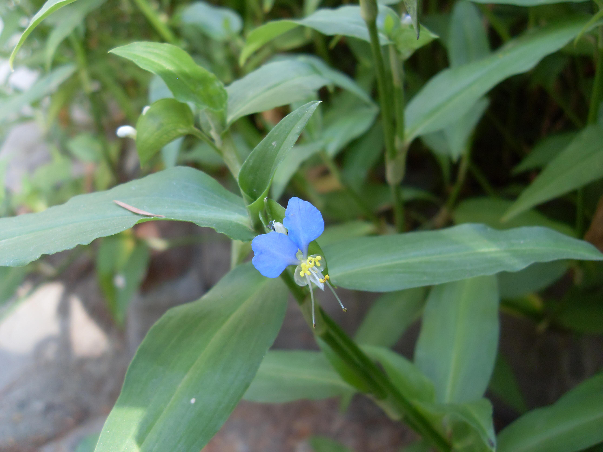

## 鸭跖草

---

**拉丁名:**  _Commelina communis Linn _

**科 属:** 鸭跖草科 鸭跖草属

**别 名:** 竹叶草、淡竹叶
 【形  态】一年生草本。茎圆柱形，肉质，长30～60厘米，下部茎
  匍匐状，节常生根，节间较长，表面呈绿色或暗紫色，具纵细纹。
  叶互生，带肉质；卵状披针形，长4～8厘米，宽2厘米，先端短
  尖，全缘，基部狭圆成膜质鞘，总状花序，花3、4朵，深蓝色，
  生于二叉状花序 柄上的苞片内；苞片心状卵形，长2厘米，摺叠
  状，端渐尖，全缘，基部浑圆，绿色；花被6，2列，绿白色，小
  形，萼片状，内列3片中的前1片白色，卵状披针形，基部有爪，
  后2片深蓝色，成花瓣状，卵圆形，基部亦具爪 。蒴果椭圆形，
  压扁状，成熟时裂开。
 【西大分布地】三校区常见杂草，见于各处树荫草丛中。
备注：
    2009年7月5日摄于西北大学北校区生命科学学院楼后。　

**原产地:** 鸭跖草 
详细资料： 首页 下一页上一页
【拉丁名】Commelina communis Linn.
【科 属】鸭跖草科 鸭跖草属
【别 名】竹叶草、淡竹叶
 【形 态】一年生草本。茎圆柱形，肉质，长30～60厘米，下部茎
 匍匐状，节常生根，节间较长，表面呈绿色或暗紫色，具纵细纹。
 叶互生，带肉质；卵状披针形，长4～8厘米，宽2厘米，先端短
 尖，全缘，基部狭圆成膜质鞘，总状花序，花3、4朵，深蓝色，
 生于二叉状花序 柄上的苞片内；苞片心状卵形，长2厘米，摺叠
 状，端渐尖，全缘，基部浑圆，绿色；花被6，2列，绿白色，小
 形，萼片状，内列3片中的前1片白色，卵状披针形，基部有爪，
 后2片深蓝色，成花瓣状，卵圆形，基部亦具爪 。蒴果椭圆形，
 压扁状，成熟时裂开。
【西大分布地】三校区常见杂草，见于各处树荫草丛中。
备注：
 2009年7月5日摄于西北大学北校区生命科学学院楼后。　

**形  态:** 一年生草本。茎圆柱形，肉质，长30～60厘米，下部茎匍匐状，节常生根，节间较长，表面呈绿色或暗紫色，具纵细纹。叶互生，带肉质；卵状披针形，长4～8厘米，宽2厘米，先端短尖，全缘，基部狭圆成膜质鞘，总状花序，花3、4朵，深蓝色，生于二叉状花序柄上的苞片内；苞片心状卵形，长2厘米，摺叠状，端渐尖，全缘，基部浑圆，绿色；花被6，2列，绿白色，小形，萼片状，内列3片中的前1片白色，卵状披针形，基部有爪，后2片深蓝色，成花瓣状，卵圆形，基部亦具爪。蒴果椭圆形，压扁状，成熟时裂开。

**西大分布地:** 三校区常见杂草，见于各处树荫草丛中。

**备注:** 2009年7月5日摄于西北大学北校区生命科学学院楼后。　

 

