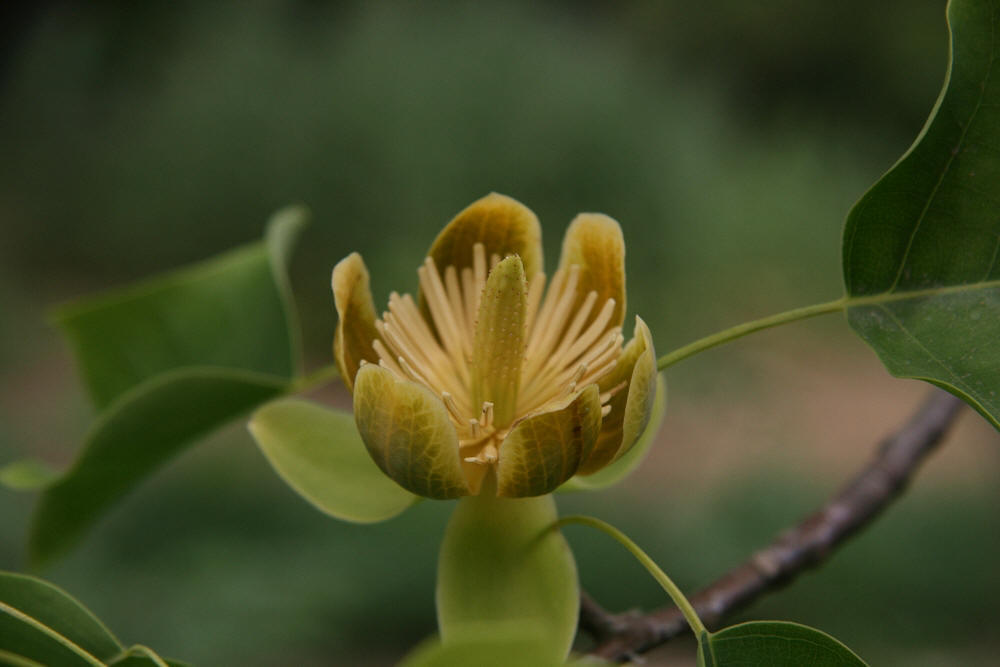

## 鹅掌楸

---

**拉丁名:**  _Liriodendron chinense (Hemsl.) Sarg _

**科 属:** 木兰科 鹅掌楸属

**别 名:** 马褂木
 【原产地】中国
 【形  态】落叶乔木，树高达40米，胸径1米以上。叶互生
  ，长4～18厘米，宽5～19厘米，每边常有2裂片，背面粉白
  色；叶柄长4～8厘米。叶形马褂。花单生枝顶，花被片9枚，
  外轮3片萼状，绿色，内二轮花瓣状黄绿色，基部有黄色条
  纹。聚合果纺锤形，长6～8厘米，直径1.5～2厘米。小坚果
  有翅，连翅长2.5～3.5厘米。
 【西大分布地】北校区见于化工学院南侧；南校区见于南北外
  道路两侧。
 备注：

**原产地:** 中国
【形 态】落叶乔木，树高达40米，胸径1米以上。叶互生
 ，长4～18厘米，宽5～19厘米，每边常有2裂片，背面粉白
 色；叶柄长4～8厘米。叶形马褂。花单生枝顶，花被片9枚，
 外轮3片萼状，绿色，内二轮花瓣状黄绿色，基部有黄色条
 纹。聚合果纺锤形，长6～8厘米，直径1.5～2厘米。小坚果
 有翅，连翅长2.5～3.5厘米。
【西大分布地】北校区见于化工学院南侧；南校区见于南北外
 道路两侧。
 备注：

**形  态:** 落叶乔木，树高达40米，胸径1米以上。叶互生，长4～18厘米，宽5～19厘米，每边常有2裂片，背面粉白色；叶柄长4～8厘米。叶形马褂。花单生枝顶，花被片9枚，外轮3片萼状，绿色，内二轮花瓣状黄绿色，基部有黄色条纹。聚合果纺锤形，长6～8厘米，直径1.5～2厘米。小坚果有翅，连翅长2.5～3.5厘米。

**西大分布地:** 北校区见于化工学院南侧；南校区见于南北外 道路两侧。 

**备注:** 

 

